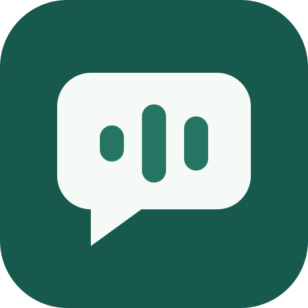

<p align="center"></p>
<h1 align="center">SpeechBridge</h1>
<p align="center"><strong>Speech practice for adults with acquired dysarthria</strong></p>
<p align="center">Everyday words, at your own pace.</p>
<p align="center">Flutter · 한국어 / English · MIT</p>

<p align="center"><a href="https://clevekim00.github.io/mj_dialog/readme.html">한국어 탭으로 읽기</a> · <a href="https://clevekim00.github.io/mj_dialog/readme.en.html">Read in English</a></p>

The linked document site opens Korean and English in tabs on the same page. GitHub README supports navigation links only. [All documents](https://clevekim00.github.io/mj_dialog/documents.en.html) · [Illustrated app introduction](https://clevekim00.github.io/mj_dialog/promotion.en.html) · [Illustrated user guide](https://clevekim00.github.io/mj_dialog/user-guide.en.html)

<details><summary>Markdown source files</summary>

[한국어](README.md) · [English](README.en.md)

</details>

<!-- document-body -->

## My sentences and easing tension

**Training → Sentence practice → Read my sentence twice** accepts reviewed text or OCR, keeps dated A/B recordings with individual AI feedback, and plays both sequentially for comparison. Recording/playback work offline; AI requires a configured model/server and upload consent.

**Training → Ease speaking tension** and contextual buttons offer comfortable posture, natural breathing and short-phrase preparation. [Flow, design and implementation scope](docs/sentence-repeat-and-mouth-video-plan.en.md#10-implementation-status--2026-10-02).


## Games

Use **Today → Training → Games → Records → Settings**. Games contains **Word speaking game** (untimed by default) , **Syllable adventure run**, and **Gentle voice flight**. Oral training and MPT stay under Training. In Records, select Games to see both games. [Current navigation and compatibility](docs/game-menu.en.md).

## Maximum phonation time (MPT)

Training → Comfortable voice practice → **Maximum phonation time (MPT)** provides observer timing for three single-breath “ah” trials. The longest of three confirmed trials is saved with recordings and waveforms in the separate MPT record category. Rest between trials; interrupted or unreviewed attempts do not count. This is a protocol recording tool, not a clinically validated diagnostic test.

[Procedure, limitations and implementation](docs/mpt-measurement.en.md).

## 📌 Project overview

Malieum (SpeechBridge) helps **adults with acquired dysarthria** practice speaking briefly and regularly at home. Voice conversation, reading aloud, recording playback, fatigue/goal records, and practice history are designed to help users and caregivers review changes over time.

> This is a practice-support tool, not a substitute for professional assessment or support. Consult a professional when adjusting a practice plan.

### App introduction and user guide

These links open **rendered document pages**, not source files. Korean is the default, and the language controls at the top let readers switch to English.

| Document | Korean (default) | English |
| --- | --- | --- |
| Promotional document | [About the app](https://clevekim00.github.io/mj_dialog/promotion.html) | [About SpeechBridge](https://clevekim00.github.io/mj_dialog/promotion.en.html) |
| User guide | [Instructions](https://clevekim00.github.io/mj_dialog/user-guide.html) | [User guide](https://clevekim00.github.io/mj_dialog/user-guide.en.html) |

Large illustrations and short sentences explain the app. Printing/PDF saving is supported. For offline reading, generate the site, keep the entire `docs/site/` folder, and open `index.html`.

### Key features

- 🏁 **Today's practice first** — Start on Home and choose today's activity directly.
- 🧭 **Practice onboarding** — Set safety acknowledgement, practice period, goals, and fatigue criteria on first use.
- 🎙 **Flexible conversation input** — Use speech, keyboard, or prepared phrases.
- 📖 **Structured pronunciation practice** — Separate word game, short sentences, long sentences, and free speech for repetition.
- 🧑‍⚕️ **Session records** — Save today's goal, pre-practice fatigue, recording duration, and feedback.
- 🛡 **Permission guidance** — Explain microphone/speech-recognition permissions to first-time users.
- 🤖 **Checkable feedback** — Show text match for reading; do not invent scores for recognition failures or free speech.
- 🕗 **Unified history** — Review and filter AI conversations and reading practice together.

---

## 🏗 Project structure

```text
lib/
├── main.dart                                    # App entry and permission-based StartupResolver
├── features/
│   ├── chat/                                    # AI conversation
│   │   ├── provider/
│   │   └── view/
│   ├── onboarding/                              # Safety and initial goals
│   └── practice/                                # Reading practice
│       ├── model/                               # Modes and content models
│       ├── provider/                            # State and recording/evaluation logic
│       └── view/                                # Practice and history screens
└── services/
    ├── api/
    │   └── ai_service.dart                      # Gemma inference and prompts
    ├── audio/
    │   ├── audio_recorder_service.dart          # Local recording with record
    │   ├── audio_player_service.dart            # Playback with audioplayers
    │   ├── stt_service.dart                     # Speech recognition
    │   └── tts_service.dart                     # Speech synthesis
    ├── history_service.dart                    # Conversation history
    ├── practice_content_service.dart           # Word/short/long-sentence content
    ├── practice_history_service.dart           # Reading-practice history
    ├── practice_sentence_service.dart          # Existing sentence library
    ├── permission_service.dart                 # Cross-platform permissions
    └── profile storage                         # Practice profile/onboarding
```

---

## 📋 Changelog

### 2026-09-15 · Consonant selection and practice stability

- From Home, choose onset/coda and record syllables, words, or sentences 3/5/10 times. Highlight targets, compare recordings of the same item, and complete/resume sessions.
- Fix record/stop controls to the bottom of consonant/sentence screens and protect item changes and exits during recording.
- Preserve repetition settings in oral/breathing training, with autosave, partial completion, and resume. Show onboarding goals and daily time on Home.
- Word practice defaults to no time limit. Keep legacy scores and unassessed records separate from new text-match statistics.
- Request server analysis only after separate consent; apply cancellation, overall timeouts, access control, and result expiry. Production authentication and clinical validation remain separate requirements.

See the [implementation record](docs/dysarthria-implementation-2026-09-15.en.md) for flows, validation, and remaining scope. Entries below describe earlier changes at their respective dates.

### 0. Structured pronunciation-practice modes

- Add a typing-practice-style selector for word game, short-sentence reading, long-sentence reading, and free conversation.
- Falling words disappear when correctly spoken; the game ends when a word reaches the bottom.
- Give the word game its own screen focused on board, difficulty, score, and speech controls.
- Review unsuccessful words scoring below 70 through “Review missed words.”
- Vary ordinary words and tongue-movement syllables by easy/normal/focused difficulty.
- Structure words/sentences as `PracticeContentItem` with mode, category, difficulty, and target sounds.
- Add/edit/delete personal long sentences for repeated practice.
- Store mode, content ID, category, difficulty, retries, and consecutive successes in practice records.
- View per-mode records and difficult sound groups in history/dashboard.

### 0. Tongue routine and 2D tutor

- Select tongue, face, or breathing training from the exercise card on today's-practice Home.
- The tongue menu includes the existing tongue routine and continuous alternating movements.
- Add a “Before practice / 3-minute tongue warm-up” card to Home.
- Restore the temporary educational animated avatar on face, breathing, and continuous-alternation screens.
- Future Rive/Lottie/Live2D assets can replace it using the same stages and 2D mouth-shape names.
- The dashboard tongue-routine card shows completion days and average duration over seven days and allows repeating today's routine.
- Add before/after fatigue, safety guidance, step timers, pause/next/stop, and completed-record saving.
- Add “Repeat tongue exercises” on completion to repeat within the same session.
- Replace 3D GLB previews on preparation/execution screens with a 2D tutor following the attached reference.
- Draw lip outline, mouth cavity, teeth, tongue, center line, and cheek-press highlights with Canvas-based 2D layers based on `animationType`.
- Remove `model_viewer_plus` and the `assets/models/tongue_exercise_preview.glb` declaration.
- Long-term tutor/mouth-shape/exercise-library design: [2D platform plan](docs/ai-speech-therapy-avatar-platform.en.md).

### 0. Sentence repetition and recording comparison

- Provide latest-recording playback on sentence results, plus previous-recording playback when repeating the same sentence.
- “Repeat this sentence” preserves the target for re-recording in one- or two-sentence units.
- Recording-library “Practice again” reopens past sentences/words.
- Lowest-score sorting and saved-for-repetition filtering collect difficult items.
- “Delete unplayable recordings” removes records whose audio files no longer exist.
- Home shows “Read difficult sentences again” based on low scores/retries.
- Enabling mouth-video capture saves silent front-camera video with recording; results offer video playback.
- Practice shows front-camera preview; the library can reopen saved mouth videos.
- Free conversation also offers mouth-video capture and latest-video playback.
- Implementation order and remaining work: [sentence/video plan](docs/sentence-repeat-and-mouth-video-plan.en.md).

### 0. Reflecting the speech-practice purpose

- Add first-use onboarding for safety acknowledgement and goals.
- Extend session records with today's goal, pre-practice fatigue, and recording time.
- Add functional communication phrases for hospital/home/family/phone situations.
- Add seven-day practice continuity and average fatigue to the dashboard.

### 1. Reading aloud

- Let users read supplied or self-entered text and receive pronunciation scores/feedback.
- Replay their recordings and review coaching from the AI “Young-eun.”

### 2. Free reading and unified history

- Introduce free reading without fixed text, with evaluation.
- Integrate conversation and practice sessions into the main history with filtering.

### 3. UI refinements and fixes

- Add scrolling to prevent bottom overflow with long feedback cards.
- Add dedicated pronunciation-practice icons and premium badges.

---

## 🚀 Running the app

### Prerequisites

- Flutter 3.38+
- Gemma 2B model for mobile: `assets/gemma-2b-it-gpu-int4.bin`

### Build and run

```bash
# Install dependencies
flutter pub get

# Run on macOS
flutter run -d macos

# Run on iOS (recommended)
flutter run -d ios

# Release build on a physical iOS device; verify standalone Home-screen launch
scripts/run_ios_release_device.sh

# Run on Android
flutter run -d android
```

### Physical iOS release script

The following command avoids the standalone Home-screen launch limitation of iOS debug apps and directly installs/runs a release build on the device:

```bash
flutter run --release -d 00008027-000849220A31002E --no-resident
```

Use the script for a consistent invocation:

```bash
scripts/run_ios_release_device.sh
```

Choose another device:

```bash
scripts/run_ios_release_device.sh --device <device-id>
```

Or override the default through an environment variable:

```bash
IOS_DEVICE_ID=<device-id> scripts/run_ios_release_device.sh
```

## Training availability and management server

All 46 oral/breathing exercises are open by default. Per-exercise remote policy support is implemented in the app; the management server API is designed but not deployed. [API design and server status](docs/training-availability-and-server.en.md).

New **Syllable adventure run**: Korean consonant + ㅏ jumps, consonant + ㅓ ducks. [Game guide](docs/game-menu.en.md).

Choose Cheese or Mochi and run through three stages of 12, 16 and 20 obstacles. Includes free jump/duck actions, comfort mode and challenge mode with two retries per stage.

Word speaking defaults to continuous listening and automatic judging, with Cheese cheering along. A fixed control stops listening for a break.

MPT can automatically time voice onset and offset, with recording review before acceptance. Manual timing remains available. [Timing guide](docs/mpt-measurement.en.md).

[Integrated changes and verification scope](docs/release-notes-2026-10-03.en.md).
