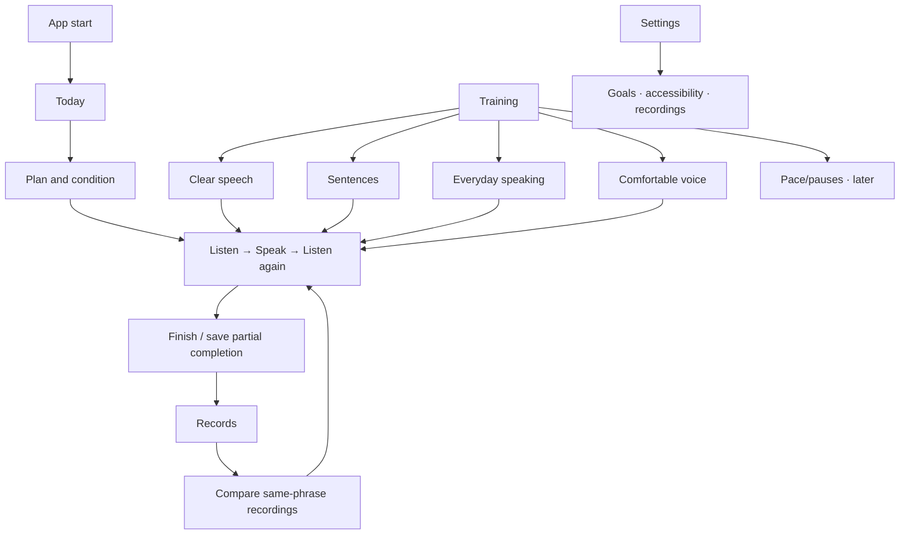

# Speech Rehab Adaptive UI and Menu Architecture

[한국어](adaptive-ui-menu-architecture.md) | [English](adaptive-ui-menu-architecture.en.md) | [All documents](README.en.md)

Revised 2026-09-25. Identity is now centered on adult acquired dysarthria and self-practice. Sections 1–6 are **target designs**, not claims of completed implementation. Feature retention/reduction, record models, and phased acceptance criteria follow [section 5 of the integrated blueprint](../blueprint-acquired-dysarthria-daily-rehab.en.md). Sections 7–10 record the existing oral/breathing subsystem implementation.

## 1. Purpose

Provide consistent information architecture so adults with acquired dysarthria can easily start a chosen amount of home practice, repeat personally useful speech, and review recordings/records. Duration and repetitions are individualized; the app does not prescribe one amount for everyone.

Do not create separate app structures per platform. Share feature/menu meaning and adapt only navigation and content layout to available window width and input method.

## 2. Shared information architecture

### Today

- Today's everyday goal and current plan.
- Start today's practice or resume an unfinished session.
- Estimated duration and “Shorter / Change plan.”
- Completed-practice summary and one recent recording.

Do not repeat the entire consonant/tool/game catalog on Home. Check condition immediately before starting.

### Training

- Clear speech: consonants, syllables, words; optional alternating articulation.
- Sentences: short, long, personal; listen and repeat.
- Everyday speaking: requests, explanations, other situations, with free speech inside.
- Comfortable voice: breathing/phonation and maintaining a comfortable level through a sentence.
- Pace and pauses: phrase grouping/visual cues—follow-up implementation.
- Supporting area: personal plan and optional lip/tongue preparation.

These purpose-based lists form the feature catalog. Typical users start from Today's plan rather than choosing from it every time. Move waveforms/frequency to record details and microphone checks to Settings. Exclude target-pitch matching from default categories; offer it only as an optional task with a clear purpose.

Reduce quantity-led labels such as “46 exercises” without a speaking goal. Reuse existing oral/breathing hubs/players below this structure, preserving expert-only locks.

### Records

- Unified date-based list as the initial default.
- Calendar after integrated aggregation is implemented.
- Same-phrase recording comparison and practice again.
- Weekly practice, fatigue, and self-reported changes.
- Reference measurements inside recording details.

Remove Communication as a separate top-level menu and integrate it into everyday-speaking training. If communication assistance expands later, review it separately from training performance.

### Settings

- Goals, current session duration, optional daily repetition goal.
- Accessibility: text, spoken guidance, automatic advance.
- Microphone check.
- Recording/camera/external-analysis consent, deletion, export.
- Language, offline content, help.
- Notifications only after checking implementation status.

## 3. Platform navigation

| Width | Typical environment | Navigation | Content |
|---|---|---|---|
| 0–599px | Phone, narrow web | Four bottom destinations | One screen at a time |
| 600–839px | Small tablet, split screen | Compact NavigationRail | Single or list/detail |
| 840–1199px | Landscape iPad, small desktop | NavigationRail | Two-column list/detail |
| ≥1200px | Desktop, wide web | Expanded sidebar | Two/three columns with max width |

Keep Today / Training / Records / Settings in the same order on phones and wide screens. Eliminate More. Retain text beneath icons even on narrow side navigation.

Use actual window width, not device name or OS, so iPad Split View and resized desktop windows adapt naturally.

## 4. Core screen principles

### Today

The largest action after launch is “Start today's training.” Prioritize goal, expected duration, and progress over feature selection.

### Training

Use the purpose-based list above. After selecting a purpose, prioritize familiar tasks and personal phrases. Enter the older tongue/lip/alternating/breathing lists only after choosing oral preparation. Alternating speech and breathing speech tasks can also be reached from articulation/voice goals using the same content IDs.

Each exercise item provides:

- Number and name.
- About three seconds of silent preview or a poster.
- Default repetitions and expected duration.
- General/caution/expert-confirmation category.
- Start now and Add to my routine.

Starting training hides global navigation for focus on the demonstration, current caption, repetitions, speed, pause, and exit. After repetitions, choose Next exercise, Five more, or Finish.

### Records

Phone: date list → session → recording. Calendar becomes an alternative view after implementation. Tablet/desktop: list and selected details side by side. Provide one index so users need not search separate oral/consonant/sentence/conversation menus.

### Voice analysis

Default results show what was done and recording playback. Show analysis only when Reference information is expanded, with one graph at a time on phones. Do not expose every graph by default even on wide screens. Never label text match as pronunciation accuracy or recovery.

## 5. Accessibility and safety

- Ordinary buttons at least 48px; primary training controls at least 56px.
- Text labels or accessibility descriptions for icons.
- One main action per screen.
- Do not rely on color alone for success/caution.
- Large repetition, remaining-time, and recording-state displays.
- Space controls for tremor and motor limitations.
- Give a concrete next action rather than “Failure.”
- Retain instructions to stop for pain, dizziness, or breathing discomfort.
- The app does not replace clinician diagnosis/treatment.

## 6. Flutter structure

```text
AdaptiveAppShell
├─ Compact (<600)
│  └─ NavigationBar: Today / Training / Records / Settings
├─ Medium·Expanded (600–1199)
│  └─ NavigationRail: same four destinations with text labels
└─ Wide (>=1200)
   └─ Extended NavigationRail and wide content

Training
├─ Clear speech → consonants / syllables / words
├─ Sentences → short / long / personal
├─ Everyday speaking → situations / free speech
├─ Comfortable voice → breathing/phonation
├─ Pace and pauses → follow-up
└─ Optional preparation / personal plan
```

Keep existing players/data while a common shell switches destinations. Use `AppDestination { today, training, records, settings }` rather than overloading integer indices. Pass explicit goals/content/mode/session through `TrainingLaunchSpec`. Replacing the router is not a prerequisite.

## 7. Applied scope

Included:

- Common adaptive shell.
- Phone bottom navigation.
- Tablet/desktop side navigation.
- Unified oral/breathing hub with four categories.
- Focused player sharing video/captions/repetition.
- Recommended routines and one personal routine.
- Records hub.
- Communication hub.
- Settings hub.
- Links to existing training/analysis screens.

Follow-up: calendar details, multiple personal routines, clinician-shared routine codes, remote video packs, and wide-screen multi-panel voice analysis.

## 8. Oral/breathing hierarchy

### 8.1 Phone

```text
Training tab → Oral/breathing hub → Category or routine
→ Exercise list → Settings bottom sheet → Full-screen player → Summary
```

Navigate one screen at a time. Hide bottom navigation during playback and confirm interruption on Back.

### 8.2 Tablet/desktop

```text
Left: categories and routines
Center: exercise list
Right: selected preview/settings
Full screen or large modal: player
```

Use the focused player once repetitions begin. A wider navigation layout is not a reason to scatter video and controls.

### 8.3 Hub priority

1. Start today's recommended routine.
2. Resume or repeat the latest routine.
3. My routine.
4. Tongue/lip/alternating/breathing categories.
5. Search/filter all exercises.

Search should cover name, body part, and safety level across 46 items. In MVP, prioritize category/number browsing over text search.

## 9. Menu names and routes

### 9.1 Visible labels

| Earlier label | New label |
|---|---|
| Exercise | Training |
| TongueExercise | Tongue exercises |
| Facial exercise | Lip exercises |
| Continuous alternating exercise | Alternating exercises |
| BreathingTraining | Breathing training |
| Phonation training · Voice tools | Phonation/voice analysis |

### 9.2 New routes

```text
/guided_training
/guided_training/tongue
/guided_training/lip
/guided_training/alternating
/guided_training/breathing
/guided_training/player
/guided_training/routine_builder
```

Retain named routes in the first implementation. Redirect old routes to the new category/default routine for one release to preserve older Home cards and entry points.

## 10. Settings changes

Expand Settings > Training repetitions into Settings > Oral/breathing training.

- Default repetitions: 5/10/20.
- Default speed: 0.5/0.75/1×.
- Captions on/off.
- Caption size: 100/125/150%.
- TTS guidance on/off.
- End-of-repetition vibration on/off.
- Show caution items on/off.

General settings must not unlock expert-confirmation items. Keep them hidden in the build until clinical review is complete.

## 11. Review and redesign evidence, 2026-09-25

### 11.1 Scope checked

Built source `ca261bb` with `flutter build macos --debug --no-pub`, relaunched, retained existing settings, and visited all five top-level menus. Images below are original captures saved and reopened during this run. They are 2× resolution captures of the first viewport of an 800×632 logical-pixel window. Content below the window may be outside the capture and is not claimed as visually verified.

Did not test actual recording, camera, external analysis, training completion, patient usability, physical phones, or the complete screen-reader flow. Lower-level training/storage observations come from source review. Prior test counts were not reused as new validation. No feature code changed; only documents and screen evidence were updated.

### 11.2 Observations by step

| Step | Screen/state | Strength | Issue and improvement |
|---|---|---|---|
| 1 | Today—priorities need work | Large consonant button and condition display | Consonant selection competes with recommended long sentences; long sentences are universally called low-burden. Show one plan with a justified short explanation. |
| 2 | Training—recategorize | Two large readable cards | Title says Exercise; content is limited to oral/voice tools. Include all speaking practice and consistent Korean guidance. |
| 3 | Records—unify | Clear replay purpose | Separate calendar/progress/recording/analysis/oral entries. Simplify to date list and recording details. |
| 4 | Communication—integrate into training | Clear value of everyday phrases | Free AI conversation comes first; sentence practice is outside Training. Move into situation practice. |
| 5 | Settings—reprioritize | Language, goals, and device-check foundations | Downloads precede goals. Prioritize goals/accessibility/recordings and simple terms. |

#### 1. Today


Risk: the narrow sidebar hides text, forcing icon memorization. Three top icons appeared unnamed in the AX tree. Actual VoiceOver reading still needs testing. Large main buttons are a strength; fixing priorities matters before replacing all colors.

#### 2. Training


Risk: English safety copy appears in Korean UI; gray text looks small/faint. Improve language/contrast, but screenshots alone cannot establish contrast ratios or compliance. Explain the speaking goal rather than leading with “14 tongue / 12 lip…” counts.

#### 3. Records


Risk: the menu does not explain what “average score” measures. The calendar label differs from the actual list implementation. Prioritize past practice and same-phrase playback. The oral-record card extends below the first viewport, so its full layout was not verified here.

#### 4. Communication


Risk: users must infer the difference between everyday and short sentences. Connect one sentence through preparation → repetition → situation practice. AI is a practice partner, not a pronunciation assessor.

#### 5. Settings


Risk: goal copy refers to daily repetitions while linked onboarding selects minutes. Describe the actual adjustable value. An accessibility-principles notice in AX/source is not evidence that text enlargement is implemented.

### 11.3 Mapping existing features to target menus



| Existing entry | Target entry | Rule |
|---|---|---|
| Home consonant card | Training > Clear speech | Reuse existing selection |
| Word game | Training > Clear speech > Words | Retain stored mode; change label/default experience |
| `/practice` | Training > Sentences | Explicitly pass short/long/personal conditions |
| Communication > Everyday phrases | Training > Everyday speaking | Pass fixed situation/text, avoiding stale mode |
| Free conversation | Everyday speaking > Optional mode | Add goal/end conditions; separate typed-input performance |
| `/guided_training` | Goal-specific breathing/articulation and optional preparation | Share IDs/player; avoid double counting |
| `/voice_analysis_menu` | Optional training feedback / record details | Do not expose the whole tool catalog as default training |
| Multiple history screens | Records > Date > Session > Recording | Unified reads through original-store adapters |
| More > Settings | Settings | Direct access on compact screens too |

Target Home order: today's goal → selected plan/duration → main button → change plan → recent record. Duration reflects the actual selected plan, not an example. Target results: completed activity → playback → repeat/finish → collapsed reference information. Reuse current colors, cards, and playback controls.

### 11.4 Validation targets

- Verify all four destinations and selection retention at 360px and 599/600px, 1199/1200px boundaries.
- Verify situation selection opens consistent content regardless of the preceding `/practice` mode.
- Verify filter changes, deletion, midnight boundaries, and resumed completion do not double-count.
- After onboarding, start selected practice within two actions from Home; count permission/safety separately.
- Test enlarged text, VoiceOver/TalkBack, keyboard, and touch with actual users/devices.
- Implement P0 → P1 → P2 from the blueprint. This deliverable is reviewable planning/design, not an already completed app redesign.
