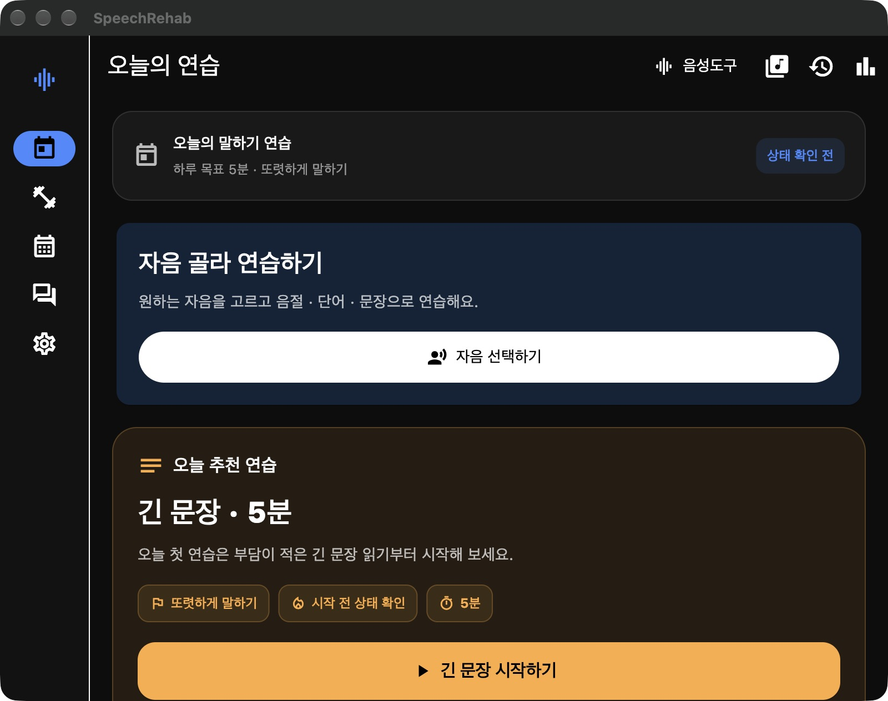
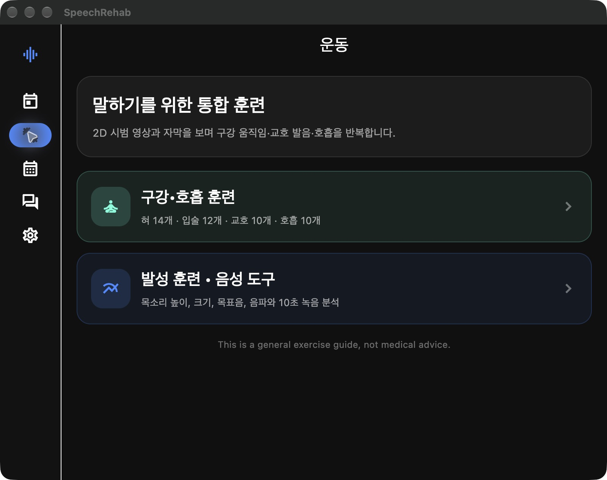
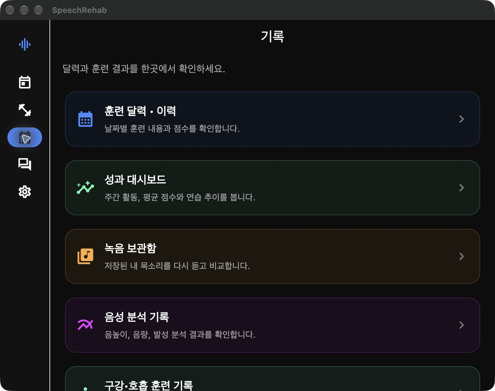
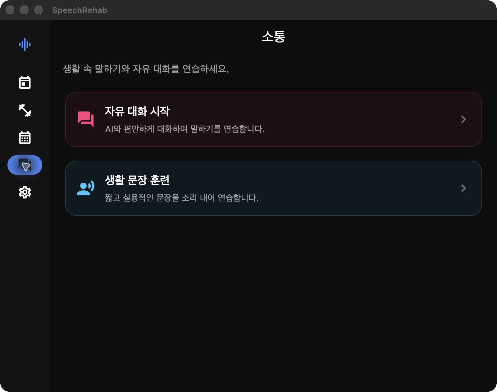
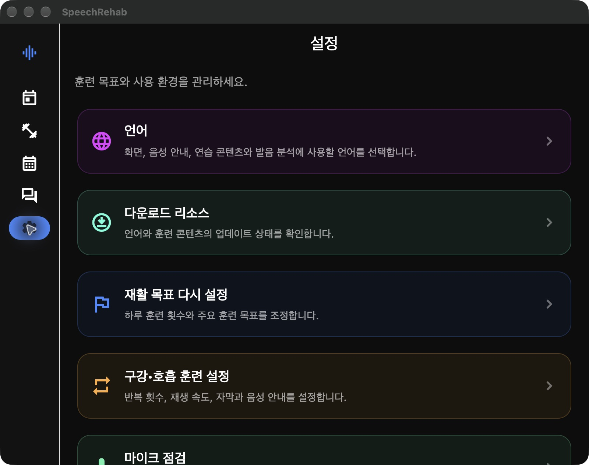
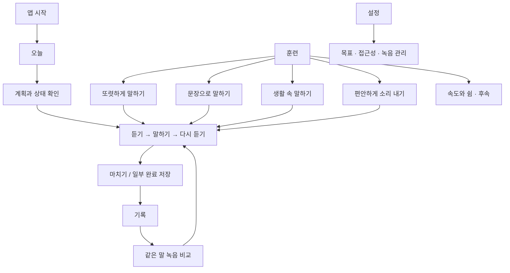

# Speech Rehab 적응형 UI 및 메뉴 구조 설계서

[한국어](adaptive-ui-menu-architecture.md) | [English](adaptive-ui-menu-architecture.en.md) | [전체 문서](README.md)

개정: 2026-09-25. 성인 후천성 마비말장애·자가훈련 중심으로 정체성을 확정했다. 1~6절은 **목표 설계**이며 현재 구현 완료를 뜻하지 않는다. 기능별 유지·축소 판단, 기록 모델, 단계별 인수 기준은 [통합 설계서 5절](../blueprint-acquired-dysarthria-daily-rehab.md#5-제품-정체성기능메뉴-재설계--2026-09-25)을 따른다. 7~10절은 기존 구강·호흡 하위 기능의 구현 기록이다.

## 1. 목적

성인 후천성 마비말장애 사용자가 집에서 선택한 분량의 연습을 쉽게 시작하고, 필요한 말을 반복한 뒤 녹음과 기록을 확인하도록 일관된 정보구조를 제공한다. 시간과 횟수는 개인별 조정 대상이며 앱이 일괄 처방하지 않는다.

플랫폼마다 별도 앱 구조를 만들지 않는다. 기능과 메뉴 의미는 공유하고, 사용 가능한 창 너비와 입력 방식에 따라 탐색 UI와 콘텐츠 배치만 변경한다.

## 2. 공통 정보구조

### 오늘

- 오늘의 생활 목표와 이번 연습 계획
- `오늘 연습 시작` 또는 미완료 세션의 `이어서 하기`
- 이번 예상 시간과 `더 짧게 / 계획 바꾸기`
- 완료한 연습 요약과 최근 녹음 한 개

자음 선택·음성도구·게임 등 전체 기능 목록은 홈에서 반복하지 않는다. 상태 확인은 시작 직전에 제공한다.

### 훈련

- 또렷하게 말하기: 자음·음절·단어, 선택적 교호 발음
- 문장으로 말하기: 짧은 문장·긴 문장·내 문장, 듣고 따라 하기
- 생활 속 말하기: 요청·설명 등 상황별 연습, 안쪽의 자유 말하기
- 편안하게 소리 내기: 호흡과 발성, 문장 끝까지 편안한 크기 유지
- 속도와 쉼 연습: 구 단위로 나누기와 시각 단서 — 후속 구현
- 보조 영역: 내 계획, 선택적 입술·혀 준비운동

목적별 목록은 기능 카탈로그다. 기본 사용자는 오늘 화면의 계획으로 시작하므로 매번 이 목록을 고를 필요가 없다. 파형·주파수는 기록의 상세 정보로, 마이크 점검은 설정으로 이동한다. 목표음 맞추기는 기본 카테고리에서 제외하고 목적이 명확한 선택 과제로만 제공한다.

훈련 목적 없이 노출하는 `운동 46개` 같은 수량 강조를 줄인다. 구강·호흡 기존 허브와 플레이어는 하위 구현으로 재사용하며 전문가 전용 운동 잠금을 유지한다.

### 기록

- 날짜별 통합 연습 목록 — 초기 기본
- 달력 — 통합 집계 구현 뒤 제공
- 같은 말의 녹음 비교와 다시 연습
- 주간 연습·피로·자가 보고 변화
- 녹음 상세의 참고 측정값

`소통`은 독립 최상위 메뉴에서 제거하고 생활 말하기 훈련으로 통합한다. 향후 실제 의사소통 보조 기능을 확대할 경우 훈련 실적과 분리하여 별도 검토한다.

### 설정

- 연습 목표·이번 연습 시간·선택적 하루 횟수 목표
- 글자·안내 음성·자동 넘김 등 접근성
- 마이크 점검
- 녹음·촬영·외부 분석 동의와 삭제·내보내기
- 언어·오프라인 콘텐츠·도움말
- 알림 — 구현 여부를 확인한 뒤 제공

## 3. 플랫폼별 탐색

| 화면 영역 | 대표 환경 | 탐색 UI | 콘텐츠 배치 |
|---|---|---|---|
| 0~599px | 폰, 좁은 웹 | 하단 메뉴 4개 | 한 화면씩 이동 |
| 600~839px | 작은 태블릿, 분할 화면 | 축약 NavigationRail | 단일 또는 목록·상세 |
| 840~1199px | iPad 가로, 작은 데스크톱 | NavigationRail | 목록·상세 2단 |
| 1200px 이상 | 데스크톱, 넓은 웹 | 확장 사이드바 | 2~3단, 최대 폭 제한 |

폰과 넓은 화면 모두 `오늘·훈련·기록·설정` 네 목적지를 같은 순서로 제공한다. 더보기 단계를 없앤다. 사이드 메뉴가 좁아져도 아이콘 아래 텍스트 라벨을 유지한다.

기기 이름이나 운영체제가 아니라 실제 창 너비로 레이아웃을 결정한다. 따라서 iPad Split View와 크기를 조절한 데스크톱 창도 자연스럽게 전환된다.

## 4. 핵심 화면 원칙

### 오늘 화면

앱 실행 후 가장 큰 행동은 `오늘의 훈련 시작`이다. 기능 선택보다 오늘의 목표, 예상 시간, 진행 상황을 먼저 보여준다.

### 훈련 화면

훈련 허브는 2절의 목적별 목록을 제공한다. 목적 선택 뒤 익숙한 과제와 내 문장을 먼저 보여준다. 구강 준비운동을 선택한 경우에만 기존 혀·입술·교호·호흡 목록으로 들어간다. 교호·호흡의 말하기 과제는 각각 조음·발성 목적에서도 같은 콘텐츠 ID로 접근할 수 있다.

운동 목록의 각 항목은 다음 정보를 제공한다.

- 번호와 운동명
- 3초 내외의 무음 미리보기 또는 포스터
- 기본 반복 횟수와 예상 시간
- 일반·주의·전문가 확인 안전 등급
- `바로 시작`과 `내 루틴에 추가`

훈련을 시작하면 전역 탐색 요소를 숨기는 집중 모드로 전환하고 시범 영상, 현재 자막, 시범 반복 횟수, 속도, 일시정지와 종료에 집중한다. 반복 완료 후에는 `다음 운동`, `5회 더`, `종료` 중 하나를 선택한다.

### 기록 화면

폰은 `날짜별 목록 > 세션 > 녹음` 순서로 이동한다. 달력은 구현 후 목록과 전환하는 보기다. 태블릿과 데스크톱에서는 목록과 선택한 상세 기록을 나란히 표시한다. 구강·자음·문장·대화 기록을 찾으려고 서로 다른 기록 메뉴에 들어가지 않도록 공통 색인을 제공한다.

### 음성 분석 화면

기본 결과는 수행 사실과 녹음 재생이다. 분석은 `참고 정보`를 펼쳤을 때 표시하며 폰은 한 번에 하나의 그래프를 보여준다. 넓은 화면이어도 모든 그래프를 기본으로 늘어놓지 않는다. 텍스트 일치도를 발음 정확도나 회복 점수로 표시하지 않는다.

## 5. 접근성 및 안전

- 일반 버튼은 최소 48px, 핵심 훈련 버튼은 56px 이상으로 한다.
- 아이콘에 텍스트 라벨 또는 접근성 설명을 함께 제공한다.
- 한 화면의 핵심 행동은 하나로 제한한다.
- 색상만으로 성공과 주의 상태를 구분하지 않는다.
- 반복 횟수, 남은 시간, 녹음 상태를 크게 표시한다.
- 손 떨림과 운동 제약을 고려해 조작 요소 사이 간격을 확보한다.
- `실패` 대신 구체적인 다음 행동을 안내한다.
- 통증, 어지럼, 호흡 불편 시 즉시 중단하도록 안전 문구를 유지한다.
- 앱은 치료사나 의료진의 진단 및 치료를 대체하지 않는다.

## 6. Flutter 구현 구조

```text
AdaptiveAppShell
├─ Compact (<600)
│  └─ NavigationBar: 오늘 / 훈련 / 기록 / 설정
├─ Medium·Expanded (600~1199)
│  └─ NavigationRail: 동일한 4개 메뉴 + 텍스트 라벨
└─ Wide (>=1200)
   └─ Extended NavigationRail + 넓은 콘텐츠 영역

훈련
├─ 또렷하게 말하기 → 자음 / 음절 / 단어
├─ 문장으로 말하기 → 짧은 / 긴 / 내 문장
├─ 생활 속 말하기 → 상황 연습 / 자유 말하기
├─ 편안하게 소리 내기 → 호흡·발성 과제
├─ 속도와 쉼 연습 → 후속 구현
└─ 선택적 준비운동 / 내 계획
```

현재 플레이어와 저장 데이터는 유지하고 공통 셸이 네 목적지를 전환한다. 정수 index에 서로 다른 화면 의미를 겹치지 않고 `AppDestination { today, training, records, settings }`를 사용한다. 세부 훈련에는 `TrainingLaunchSpec`으로 목표·콘텐츠·모드·세션 정보를 명시한다. 라우터 교체는 이 메뉴 개편의 선행 조건이 아니다.

## 7. 적용 범위

이번 적용에는 다음이 포함된다.

- 공통 적응형 앱 셸
- 폰 하단 메뉴
- 태블릿·데스크톱 사이드 메뉴
- 구강·호흡 통합 훈련 허브와 네 카테고리
- 영상·자막·반복 기능을 공유하는 집중형 플레이어
- 추천 루틴과 하나의 개인 루틴
- 기록 허브
- 소통 허브
- 설정 허브
- 기존 훈련 및 분석 화면 연결

후속 개선 범위는 달력 기반 상세 기록, 여러 개인 루틴 저장, 전문가가 공유하는 루틴 코드, 원격 영상 팩, 넓은 화면용 음성 분석 다중 패널이다.

## 8. 구강·호흡 훈련 화면 계층

### 8.1 폰

```text
훈련 탭
→ 구강·호흡 훈련 허브
→ 카테고리 또는 루틴
→ 운동 목록
→ 운동 설정 바텀시트
→ 전체 화면 플레이어
→ 완료 요약
```

폰에서는 목록과 상세를 한 화면씩 이동한다. 플레이어에서는 하단 메뉴를 숨기고 뒤로 가기 시 중단 확인을 표시한다.

### 8.2 태블릿·데스크톱

```text
왼쪽: 카테고리와 루틴
가운데: 운동 목록
오른쪽: 선택 운동 미리보기와 설정
전체 화면 또는 큰 모달: 훈련 플레이어
```

넓은 화면에서도 실제 반복 훈련을 시작하면 집중형 플레이어를 사용한다. 탐색 구조가 넓다는 이유로 영상과 조작을 지나치게 분산하지 않는다.

### 8.3 허브 카드 우선순위

1. `오늘의 추천 루틴 시작`
2. `이어서 하기` 또는 `최근 루틴 다시 하기`
3. `내 루틴`
4. 혀·입술·교호·호흡 카테고리
5. 전체 운동 검색과 필터

검색은 46개 목록을 이름, 동작 부위, 안전 등급으로 찾을 수 있게 한다. 초기 MVP에서는 텍스트 검색보다 카테고리와 번호 탐색을 우선한다.

## 9. 메뉴 명칭과 라우트

### 9.1 사용자에게 보이는 명칭

| 현재 | 변경 |
|---|---|
| 운동 | 훈련 |
| 혀운동 | 혀 운동 |
| 얼굴운동 | 입술 운동 |
| 연속 교대운동 | 교호 운동 |
| 호흡훈련 | 호흡 훈련 |
| 발성 훈련 · 음성 도구 | 발성·음성 분석 |

### 9.2 신규 라우트

```text
/guided_training
/guided_training/tongue
/guided_training/lip
/guided_training/alternating
/guided_training/breathing
/guided_training/player
/guided_training/routine_builder
```

현재 앱이 이름 기반 라우트를 사용하므로 1차 구현도 같은 방식을 유지한다. 기존 라우트는 한 릴리스 동안 새 카테고리 또는 기본 루틴으로 전달해 홈 카드와 이전 진입점이 깨지지 않게 한다.

## 10. 설정 메뉴 변경

`설정 > 훈련 반복 횟수`를 `설정 > 구강·호흡 훈련`으로 확장한다.

- 기본 반복 횟수: 5·10·20회
- 기본 재생 속도: 0.5·0.75·1배
- 자막: 켜기·끄기
- 자막 크기: 100·125·150%
- TTS 안내: 켜기·끄기
- 반복 종료 진동: 켜기·끄기
- 주의 항목 표시: 켜기·끄기

전문가 확인이 필요한 항목은 일반 설정만으로 잠금을 해제하지 않는다. 임상 검토가 끝나기 전에는 앱 빌드에서 숨김 상태로 유지한다.

## 11. 2026-09-25 현행 화면 검토와 재설계 근거

### 11.1 확인 범위

소스 `ca261bb`를 `flutter build macos --debug --no-pub`로 빌드한 뒤 앱을 재실행했다. 기존 사용자 설정을 유지하며 상위 메뉴 다섯 곳을 직접 이동했다. 아래 이미지는 이번 실행에서 저장하고 다시 열어 확인한 원본 캡처다. 800×632 logical px 창의 2배 해상도 이미지이며 스크롤 화면의 첫 뷰포트다. 창 아래 내용은 캡처 밖에 있을 수 있으므로 해당 내용을 시각적으로 검증했다고 주장하지 않는다.

실제 녹음·카메라·외부 분석·훈련 완료·환자 사용성·폰 실기기·스크린리더 전체 흐름은 이번에 시험하지 않았다. 하위 훈련·저장 동작은 소스 검토로 구분했다. 이전 보고서의 테스트 통과 수는 이번 검증 결과로 재사용하지 않았다. 기능 코드는 변경하지 않았으며 문서와 화면 근거만 갱신했다.

### 11.2 단계별 관찰

| 단계 | 화면 / 상태 | 장점 | 문제와 개선 |
|---|---|---|---|
| 1 | 오늘 — 주요 행동 정리 필요 | 큰 자음 선택 버튼과 상태 표시 | 자음 선택과 추천 긴 문장이 경쟁. 긴 문장을 ‘부담이 적은’ 시작으로 일괄 설명. 오늘 계획 하나와 근거 있는 짧은 설명으로 정리 |
| 2 | 훈련 — 분류 재설계 필요 | 큰 카드 두 개로 읽기 쉬움 | 화면 제목은 운동, 내용은 구강/음성도구에 한정. 모든 말하기 훈련 포함, 한국어 안내 통일 |
| 3 | 기록 — 통합 필요 | 녹음 다시 듣기 목적이 명확함 | 달력·성과·녹음·분석·구강 기록의 별도 진입. 날짜별 통합 목록과 녹음 상세로 단순화 |
| 4 | 소통 — 훈련에 통합 권장 | 생활 문장 연습의 가치가 명확함 | 자유 AI 대화가 먼저 나오며 문장 연습이 훈련 밖에 위치. 생활 상황 연습으로 이동 |
| 5 | 설정 — 우선순위 조정 필요 | 언어·훈련 목표·기기 점검의 기반 | 다운로드 리소스가 연습 목표보다 앞섬. 목표·접근성·녹음 관리 우선, 쉬운 용어 사용 |

#### 1. 오늘



위험: 좁은 사이드바에 텍스트 라벨이 보이지 않아 아이콘을 외워야 한다. 상단 세 아이콘은 이 실행의 AX 트리에 이름 없는 버튼으로 나타났다. 실제 VoiceOver 읽기는 후속 검증이 필요하다. 주요 버튼의 크기는 장점이며 화면 전체 색상 교체보다 정보 우선순위 수정이 먼저다.

#### 2. 훈련



위험: 한국어 UI 안에 영어 안전 안내가 있고 회색 글씨가 작고 약하게 보인다. 언어와 대비를 개선하되 화면만으로 대비비·접근성 준수 여부를 확정하지 않는다. `혀 14개·입술 12개…`보다 어떤 말하기 목표에 도움이 되는 과제인지 설명한다.

#### 3. 기록



위험: `평균 점수`가 무엇의 점수인지 메뉴에서 설명되지 않는다. 달력 표시는 소스상 실제 목록 화면과 다르다. `지난 연습`, `같은 말 다시 듣기`를 앞에 둔다. 구강 기록 카드는 첫 화면 아래로 이어지므로 전체 모양은 이 캡처의 검증 범위 밖이다.

#### 4. 소통



위험: 사용자가 ‘생활 문장’과 ‘짧은 문장’의 차이를 추측해야 한다. 하나의 문장 콘텐츠를 준비→반복→상황 연습으로 연결한다. AI 대화는 발음 평가자가 아니라 연습 상대다.

#### 5. 설정



위험: 목표 설명은 하루 ‘횟수’를 말하지만 연결되는 온보딩 소스는 하루 ‘분’을 선택한다. 실제 조정 가능한 값으로 설명을 맞춘다. AX와 소스에 있는 `접근성 원칙` 안내는 글자 확대 등 실제 설정 기능이 구현되어 있다는 증거가 아니다.

### 11.3 목표 메뉴와 기존 기능 연결



| 기존 진입 | 목표 진입 | 연결 규칙 |
|---|---|---|
| 홈 자음 카드 | 훈련 > 또렷하게 말하기 | 기존 자음 선택 화면 재사용 |
| 단어 게임 | 훈련 > 또렷하게 말하기 > 단어 | 저장 mode는 유지, 표시명·기본 경험 변경 |
| `/practice` | 훈련 > 문장으로 말하기 | 짧은/긴/내 문장 조건을 명시해 전달 |
| 소통 > 생활 문장 | 훈련 > 생활 속 말하기 | 상황과 문장을 고정해 전달, 이전 모드 잔존 방지 |
| 자유 대화 | 생활 속 말하기 > 선택 모드 | 목표·종료 조건 추가, 텍스트 입력 실적 분리 |
| `/guided_training` | 목적에 맞는 호흡/조음 및 선택적 준비운동 | 같은 콘텐츠 ID와 플레이어 공유, 이중 집계 금지 |
| `/voice_analysis_menu` | 훈련 안의 선택 피드백 / 기록 상세 | 분석 도구 전체를 기본 훈련 목록에 노출하지 않음 |
| 여러 기록 화면 | 기록 > 날짜 > 세션 > 녹음 | 원본 저장소 어댑터를 이용한 통합 조회 |
| 더보기 > 설정 | 설정 | compact 화면도 직접 진입 |

목표 홈의 콘텐츠 순서: 오늘 목표 → 이번 계획과 예상 시간 → 주요 버튼 → 계획 바꾸기 → 최근 기록. 여기서의 시간은 예시가 아니라 실제 선택된 계획을 표시한다. 목표 훈련 결과 순서: 수행 사실 → 녹음 듣기 → 한 번 더/마치기 → 접힌 참고 정보. 색상·카드 스타일·재생 버튼은 현재 디자인을 재사용한다.

### 11.4 검증할 항목

- 폰 360px, 599/600px, 1199/1200px 경계에서 네 목적지가 모두 열리고 선택 상태가 유지되는지 확인한다.
- 생활 상황 선택이 `/practice`의 직전 모드와 무관하게 같은 목적지·콘텐츠를 여는지 확인한다.
- 기록 필터 변경, 녹음 삭제, 자정 경계, 이어하기 완료가 중복 집계를 만들지 않는지 확인한다.
- 온보딩 이후 홈에서 두 번의 조작으로 선택된 연습을 시작하는지 확인한다. 권한·안전 안내는 별도 집계한다.
- 확대 글자, VoiceOver/TalkBack, 키보드, 터치 조작을 실제 대상 기기와 사용자에게 검증한다.
- 기능 구현 순서는 통합 설계서의 P0 → P1 → P2를 따른다. 이번 산출물은 구현 승인 전에도 검토 가능한 기획·설계이며 실제 앱 개편은 아직 수행하지 않았다.
