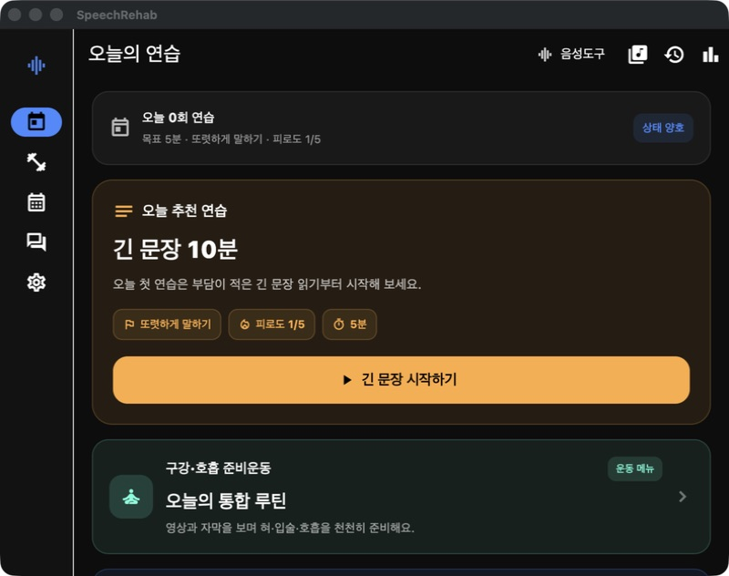
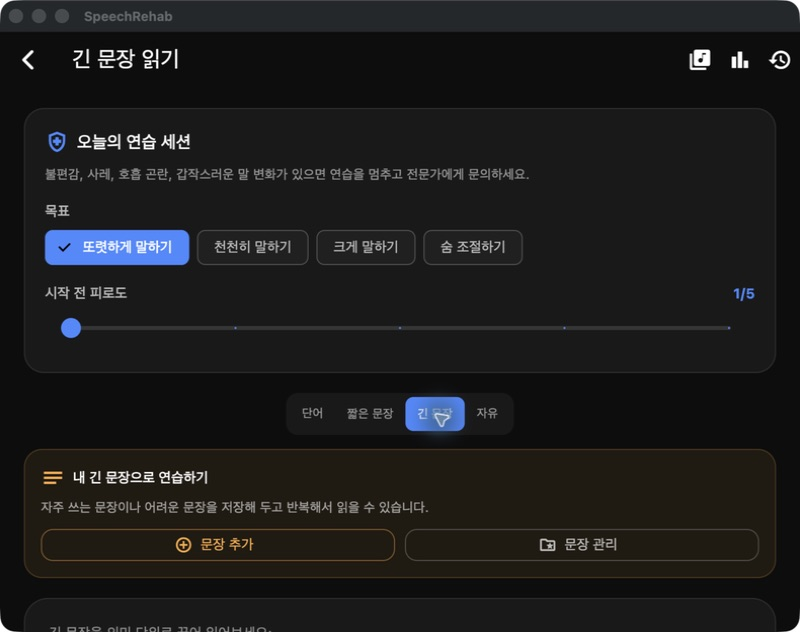
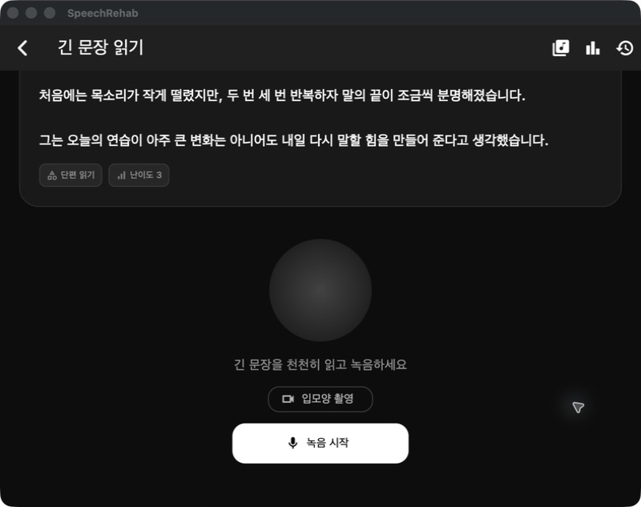

# Dysarthria training app review and improvement proposals

[한국어](dysarthria-app-review-2026-09-13.md) | [English](dysarthria-app-review-2026-09-13.en.md) | [All documents](README.en.md)

Reviewed: 2026-09-13 · Source: `1bc2f6b` · Product: Speech Rehab

Subsequent changes are recorded in the [2026-09-15 implementation log](dysarthria-implementation-2026-09-15.en.md). Observations and line numbers below refer to the review before those changes.

**The first priorities are trustworthy results, respecting the user's chosen practice amount, and adapting the flow to fatigue.** Sentence repetition, recording comparison, oral/breathing guidance, and consonant content provide a solid foundation. Connecting them into one personalized session would make them more useful.

This document separates implementation facts, screens directly observed during this review, and design proposals. It does not determine clinical effectiveness or prescribe training to an individual.

## 1. Scope and validation

- Reviewed the Flutter home, onboarding, sentence practice, games, oral exercises, history, voice analysis and storage, and the Python pronunciation-analysis server.
- Built the current macOS debug app and observed Home → Recommended long sentence → Recording preparation while keeping existing local settings. Screenshots are 800×632.
- Inspected first-run onboarding in source. Actual recording, camera capture, patient speech analysis, physical iOS/Android devices, and screen-reader usability were not verified in this run.
- Tried Back and History on the sentence screen, but the automation tool did not confirm navigation. This was not classified as a confirmed defect because an app issue could not be distinguished from a tool limitation. Games, oral training, and results were subsequently reviewed in source only.
- Existing graphify data contained structural extraction files but no completed `graph.json`. Current source was checked instead of treating historical structural data as proof of current behavior.

| Check | Result | Meaning and limits |
|---|---|---|
| `flutter build macos --debug` | Passed | Current source builds for macOS |
| `flutter analyze --no-pub` | No errors | Static analysis passed |
| `flutter test --no-pub --reporter expanded` | 71 passed | Some game tests emitted tap hit-test warnings; real interaction needs further checking |
| Server `python3 -B -m unittest discover -s tests -v` | 14 passed | Mainly fake backends/runners; not evidence of accuracy on patient speech |

No app feature code was changed. Only this review and screenshots from the run were added.

## 2. Strengths to retain and develop

1. **Re-recording the same sentence and comparing earlier recordings:** a useful foundation for hearing one's own changes.
2. **Daily-life and personal sentences:** supports meaningful hospital, family, and telephone communication.
3. **Multiple guidance formats:** oral training offers speech, captions, speed controls, vibration, and fallback guidance when video fails.
4. **Existing safeguards:** exercises requiring professional guidance are restricted, and playback pauses in the background.
5. **A precedent for expressing uncertainty:** default MFA analysis keeps accuracy `null` rather than inventing a score after alignment. General practice can use the same approach.

## 3. Priorities

These are product priorities. **First** addresses misleading assessment, practice volume, and status records; **next** supports continued use and operational reliability.

| Order | Priority | Finding | Direction |
|---|---|---|---|
| 1 | First | Free-speech recognition failure can generate a made-up sentence and 85 points | Unavailable-analysis state and no score |
| 2 | First | Text match/length presented as pronunciation scores | Separate recognition match from audio assessment |
| 3 | First | Onboarding goals are disconnected; post-session fatigue is inferred | Shared profile and actual before/after responses |
| 4 | First | Selecting 5 repetitions may revert to 20 on the next exercise | Freeze per-exercise repetitions and speed at session start |
| 5 | First | Leaving during practice or before saving loses progress | Autosave, partial completion, and resume |
| 6 | Next | A timeout without speech becomes a zero score in averages | Separate game events from assessable utterances |
| 7 | Next | Inconsistent home duration, separated text/record controls, speech-dependent interaction | Consistent simple practice and alternative input |
| 8 | Next / before external release | Incomplete timeout, transfer, and deletion contracts | Cancellation, timeouts, consent, authentication, retention |

### 1) Do not save recognition failure as successful speech

**Finding:** Empty free-speech recognition is replaced with `오늘 있었던 일을 편하게 말했습니다.` (roughly, “I spoke comfortably about my day”). Fallback assessment then returns 85 points and “Overall, it sounds clear” for nonempty free speech. Gemma is disabled on iOS, which uses this fallback. If a recording exists, the result can enter history and success streaks.

Evidence: [inserted utterance](../lib/features/practice/provider/practice_provider.dart#L1214), [iOS model disabled](../lib/services/api/ai_service.dart#L160), [85-point fallback](../lib/services/api/ai_service.dart#L319), [history save](../lib/features/practice/provider/practice_provider.dart#L1281).

**Change:** Distinguish Recorded, Recognition needs checking, Analysis available, and Analysis unavailable. Never fabricate missing speech. Make scores nullable and exclude unavailable analysis from averages, success streaks, and weak-sound decisions. Show “Your recording was saved. We could not confirm your words this time,” with Listen / Try again / Finish.

**Acceptance:** Silence, recognition failure, and model errors produce neither invented sentences nor valid pronunciation scores. Saved recordings remain playable after failure.

### 2) Separate recognition from pronunciation assessment

**Finding:** General practice sends recognized text, not original audio, to assessment. Fallback scoring uses text length and exact match; the word game gives 100 for an exact match and 40 otherwise. Conversation fallback can infer tongue-placement advice merely from the presence of a word.

Evidence: [assessment call](../lib/features/practice/provider/practice_provider.dart#L1242), [conversation fallback](../lib/services/api/ai_service.dart#L298), [text scoring](../lib/services/api/ai_service.dart#L329), [word scoring](../lib/services/api/ai_service.dart#L377).

**Change:** Label the current measure narrowly as Target sentence recognition match. Remove text-only judgments about articulation, tongue position, loudness, or intelligibility. Speech intelligibility includes what a listener understands and is not equivalent to an ASR string match. Agreement with human ratings needs separate validation against [ASHA's assessment framework](https://www.asha.org/practice-portal/clinical-topics/dysarthria-in-adults/).

**Separate consonant issue:** The optional CTC backend scores the highest target-token probability frame anywhere in a recording. Do not expose it as accuracy before replacing it with evaluation of the target position and actual phoneme interval. This differs from default MFA, which leaves scores empty. [CTC calculation](../server/pronunciation_analysis/app/acoustic.py#L50), [result UI](../lib/features/consonant_training/view/consonant_training_screens.dart#L587).

**Acceptance:** Save method, model/content version, and analysis availability. Do not present scores as treatment effectiveness before examining errors by severity, device, and environment and differences from human ratings on Korean dysarthric speech.

### 3) Connect profile and fatigue to the session plan

**Finding:** Onboarding saves goals, period, daily duration, and caregiver status, but `loadProfile()` has no caller in `lib`. Home is fixed at 5 minutes; recommendations use recent scores and the last mode. The post-session fatigue setter is unused, and a missing response becomes the pre-session value.

Evidence: [profile read](../lib/services/rehab_profile_service.dart#L49), [home goal](../lib/features/practice/view/practice_mode_selection_screen.dart#L169), [recommendation](../lib/features/practice/view/practice_mode_selection_screen.dart#L929), [fatigue assignment](../lib/features/practice/provider/practice_provider.dart#L1305).

**Change:** Read the shared profile to choose goals, sentences, and volume. Ask about current condition before practice and actual fatigue and speaking comfort afterward. Keep unanswered values missing. Offer shorter tasks/rest first when fatigue is high; avoid automatic increases. Do not prescribe from diagnosis alone. Tailoring to individual difficulties and daily communication goals follows [ASHA's individualization principles](https://www.asha.org/practice-portal/clinical-topics/dysarthria-in-adults/).

**Acceptance:** Onboarding goals/time remain consistent after relaunch and in Home/preparation. An unanswered post-session question is not counted as unchanged fatigue.

### 4) Preserve the chosen practice amount

**Finding:** Choosing 5 repetitions changes only current state. Moving to another exercise reloads its stored settings, defaulting to 20. Estimated duration ignores playback speed.

Evidence: [repeat selection](../lib/features/guided_training/view/guided_training_player_screen.dart#L378), [transition overwrite](../lib/features/guided_training/view/guided_training_player_screen.dart#L276), [default](../lib/services/training/training_settings_service.dart#L14), [estimate](../lib/features/guided_training/view/guided_training_player_screen.dart#L342).

**Change:** Freeze a session plan with repetitions and speed for each exercise before starting. Use it in both estimates and playback. Explain “5 repetitions for every exercise” versus “Use individual exercise settings.”

**Acceptance:** Four exercises selected for 5 repetitions each all run 5 times. Slower playback increases the estimate. Repetition counts never increase unexpectedly mid-session.

### 5) Preserve rest and interrupted progress

**Finding:** Leaving oral training early saves nothing. Closing the completion screen before pressing Save also exits without confirmation.

Evidence: [exit](../lib/features/guided_training/view/guided_training_player_screen.dart#L715), [save button](../lib/features/guided_training/view/guided_training_player_screen.dart#L645).

**Change:** Autosave at start, transitions, and interruption; distinguish Complete / Partially complete / Resting / Stopped. Make the stop reason optional and offer resume on return. Rest should not cause failure labels or lost records.

[NIDCD guidance](https://www.nidcd.nih.gov/health/taking-care-your-voice) recommends rest for vocal fatigue. Replace blanket “Speak louder” after recognition failure with checking the microphone, a comfortable retry, or rest, and review intensity advice for each user.

**Acceptance:** Progress survives early exit, closing immediately after completion, and returning from background. Separate rest/analysis wait from actual practice time.

### 6) Adapt games and metrics to the patient experience

**Finding:** A falling word reaching the bottom ends the game and can save a 0-point, 0-second session without speech. Averaging all sessions can make a slow game response look like poorer pronunciation. Falling pauses during recording/analysis, but continues during preparation and thinking.

Evidence: [no-speech zero record](../lib/features/practice/provider/practice_provider.dart#L945), [average](../lib/features/practice/view/dashboard_screen.dart#L20), [game over](../lib/features/practice/provider/practice_provider.dart#L737).

**Change:** Default word practice should keep one word still until the user is ready. Make falling gameplay optional, with no time limit, pause, and movement stop. Replace Failed recordings / Wrong words with Recordings to listen to again / Words to practice again. Refer to [W3C timing guidance](https://www.w3.org/WAI/WCAG22/Understanding/timing-adjustable.html).

Prioritize days practiced, actual practice time, daily-sentence performance, and perceived effort on the dashboard. Compare assessable attempts with the same sentence and method. Distinguish sessions, utterance attempts, and game events in data.

**Acceptance:** A game timeout with no speech changes neither pronunciation averages, weak-sound decisions, nor practice counts.

### 7) Simplify the first practice and offer alternative controls

**Observed:** Home's goal/badge says 5 minutes while the long-sentence recommendation says 10. Goals, fatigue, mode, and sentence management fill the initial sentence screen; the sentence and recording button are lower down. Scrolling to Record hides the start of the long sentence. Screenshots follow.

**Change:** Center Home on one practice for today, Start, and Compare recent recordings; move the full menu to separate exploration. Derive duration from one plan. Show a large sentence or meaningful phrase and fixed Listen to example / Record / Rest controls. Collapse goals and sentence management or move them to settings.

Use large fixed controls with explicit accessibility names. Provide prepared answers, editable text, and Skip when speech input fails. [W3C's speech disability guidance](https://www.w3.org/WAI/people-use-web/abilities-barriers/speech/) describes barriers in services dependent on speech recognition.

Initial onboarding currently opens practice selection directly, whereas relaunch uses the shared navigation shell. Standardize on `/app`. [Onboarding completion](../lib/features/onboarding/view/rehab_onboarding_screen.dart#L34), [shared entry](../lib/main.dart#L234).

**Acceptance:** Current text and key controls remain discoverable on small screens at 200% text. VoiceOver/TalkBack, keyboard, and necessary alternatives support start, stop, retry, and finish. Screenshots alone cannot establish accessibility compliance.

### 8) Define analysis, storage, and external-transfer contracts

| Area | Finding | Change and validation |
|---|---|---|
| iOS final recognition | Dart subscription is canceled immediately after native stop; a late final result may be lost | Await final/completion event or timeout before unsubscribing; test long pauses, slow speech, and final syllables on devices. [STT stop](../lib/services/audio/stt_service.dart#L188) |
| Analysis request | 30 seconds applies only to polling after POST; one hung request escapes the overall limit | Connection/upload/receive and overall timeouts; cancel/retry while preserving audio. [Client](../lib/features/consonant_training/services/pronunciation_analysis_client.dart#L34) |
| Audio transfer | Consonant recording is uploaded to a default local HTTP URL; no server auth/job ownership checks in code | Before external operation, explain destination/data/retention and choice; add HTTPS, auth, ownership, limits. Actual public deployment was not confirmed. [Upload](../lib/features/consonant_training/view/consonant_training_screens.dart#L447), [server](../server/pronunciation_analysis/app/main.py#L47) |
| File lifecycle | Analysis WAV uses temporary storage; deleting history removes metadata only; audio evicted by consonant-history limits also needs cleanup | Persistent storage for retained recordings; consistent metadata/file deletion. [WAV](../lib/services/audio_analysis/wav_file_service.dart#L16), [delete](../lib/services/audio_analysis/voice_analysis_repository.dart#L38) |
| Local privacy | Some speech/fatigue/scores use SharedPreferences JSON; audio uses Documents; no separate app-level encryption confirmed | Review OS protection, backups, retention, full deletion, and speech debug logs. This does not mean OS protection is absent. [Storage](../lib/services/practice_history_service.dart#L117) |

Server audio is processed in temporary directories and removed afterward; do not claim permanent server audio retention. In-memory analysis results need automatic expiry.

Voice analysis also labels total recording elapsed time as phonation duration and plots undetected pitch at 60 Hz. Separate recording duration, voiced duration, and pitch-estimation quality; leave gaps for undetected pitch. [Metrics](../lib/features/voice_analysis/model/voice_analysis_models.dart#L127), [chart](../lib/features/voice_analysis/view/voice_analysis_screens.dart#L734).

## 4. Screens observed in this run

### Step 1 — Today's practice: clear entry, inconsistent information

The large recommended Start button is visible, but the same screen conflicts between a 5-minute goal and 10-minute recommendation. Fatigue 1/5 and Good condition appear without a fresh response. Explain the recommendation basis and distinguish missing input from actual answers. Small gray helper text needs readability testing.

### Step 2 — Long-sentence preparation: useful settings, high starting burden

Goal/fatigue input is a good foundation, but the practice sentence and Record button are not initially visible at this window size. Collapse goal/mode/personal-sentence controls and show the current sentence first. Consider large selection buttons alongside sliders.

### Step 3 — Recording preparation: clear button, separated reading material

Record is large and labeled, but scrolling to it hides the sentence beginning. Reduce central decoration and keep the current phrase beside Record / Stop / Rest to reduce navigation effort. Actual recording, analysis, and completion were not exercised in this screen review.

## 5. Recommended practice flow

1. **Today's condition:** briefly check fatigue/discomfort; offer rest or less practice where needed.
2. **Today's practice:** show one plan connecting chosen goals with daily-life sentences.
3. **Listen and speak:** example → current phrase → enough preparation → recording. Time competition is not the default.
4. **One feedback item:** playback plus one supportable observation; identify unavailable analysis separately.
5. **Choose:** repeat / next / rest. Preserve progress at every stage.
6. **Finish:** record actual final fatigue and perceived difficulty; save a point to resume next time.

Keep durations/counts adjustable so product example values are not mistaken for clinical recommendations. Explain how oral preparation connects to target speech and first complete a continuous path through daily-life sentence practice.

## 6. Implementation sequence and acceptance

### Batch 1 — Remove untrustworthy results

- Remove invented speech/default high scores; add nullable scores and analysis status.
- Exclude no-speech game events from pronunciation statistics.
- Store unanswered final fatigue as missing.
- Freeze repetition/speed in a session plan.
- Autosave interrupted/completed progress.

Old history contains values without assessment source/version. Do not compare them directly with new metrics, delete them, or arbitrarily rescore them. Label them Previous assessment method.

### Batch 2 — Make everyday use easy

- Connect profile → today's plan → practice → before/after condition → history through a common session.
- Align home duration, show sentence and recording controls together, and unify entry.
- Offer untimed word practice and non-speech interaction.
- Observe actual users with dysarthria starting, recording, retrying, resting, and returning. Record moments requiring button explanations, mistakes, abandonment, and fatigue.

### Batch 3 — Validate analysis and operation

- Check iOS final STT, analysis cancellation, and timeouts.
- Complete transfer, access, and retention policies.
- Validate automatic measures against Korean patient recordings and human ratings.
- Consider simple optional export of consented recordings, targets, fatigue, and difficulty. A separate therapist portal remains lower priority because it expands MVP scope.

Regression checks should emphasize **silence, unavailable STT, delayed final syllables, high fatigue, repeat changes, interruption, re-entry, missing files, unresponsive servers, and large text**. Passing existing tests does not establish that these issues are resolved.

## 7. Follow-up: practice a chosen consonant

User suggestion: “It would be good to choose a consonant for pronunciation practice.”

**Already available:** Home's Focused consonant training supports initial/final position selection and consonant cards leading to syllables, words, and short sentences. TTS examples, recording, playback, retry, next, and history saving exist. Korean built-in content `2026.08.1` has 18 initial and 7 final targets, totaling 800 items. This is a content count, not clinical approval.

Evidence: [home entry](../lib/features/practice/view/practice_mode_selection_screen.dart#L99), [selection/training](../lib/features/consonant_training/view/consonant_training_screens.dart#L12), [Korean content](../assets/pronunciation/content/ko_consonant_core.json).

**Goal:** Use a clear name such as Choose a consonant to practice and a visible Home entry, then complete a short repeated session. Do not duplicate the existing consonant menu.

Example: `ㅅ → 사·서·소·수·스·시 → 사과·소리·수건 → “수건을 주세요.” → listen to my recording → repeat or finish`. The final sentence is proposed content, not a claim that it is already bundled. Korean examples remain Korean because they are the pronunciation targets.

| Improvement | Behavior |
|---|---|
| Clear choice | Distinguish Word beginning (initial) / Final consonant; use large buttons and keep target/position visible |
| Target emphasis | Highlight the syllable containing the target; explain the sound briefly and simply |
| Repeat session | Show repeats and remaining items; let users choose the next stage without time limits |
| Resume | Remember consonant, position, and stage; show Continue practicing ㅅ on Home |
| Comparison history | Replay/compare recordings for the same consonant, position, and item; analysis failure is not pronunciation failure |
| Content quality | Correct particles/endings such as `시간를`, `수건와`, `사람예요`; review natural daily sentences and actual target sounds |
| Reference audio | Identify current examples as TTS; later consider reviewed reference recordings |
| Recording integrity | Block stage/item changes during recording/analysis or explicitly cancel; freeze the target at start so results cannot attach to another sentence |

Next currently loops from the final item to the first, so add an explicit completion screen. The word game's filter searches initial and final consonants together and may substitute another word when none match. Distinguish it from precise position-specific consonant training. [Cycling](../lib/features/consonant_training/view/consonant_training_screens.dart#L479), [filter](../lib/services/practice_content_service.dart#L424).

Before advancing automated consonant scores, stabilize **choose → listen → record → self-compare → repeat → save**. This follow-up review changed no feature code.
