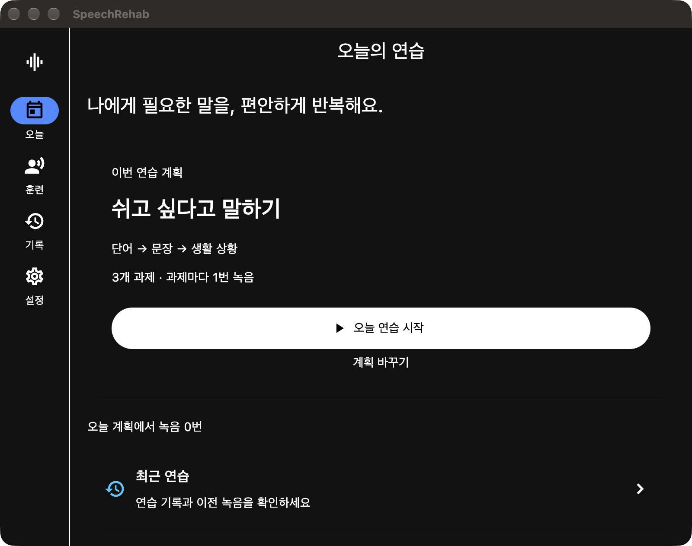
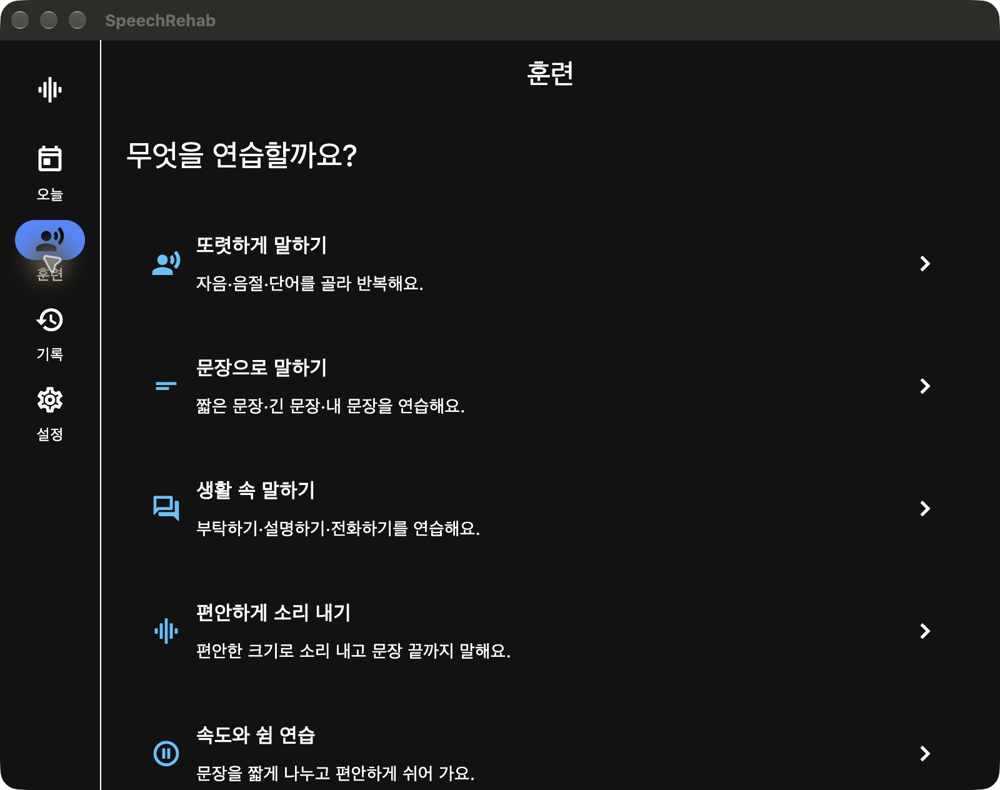
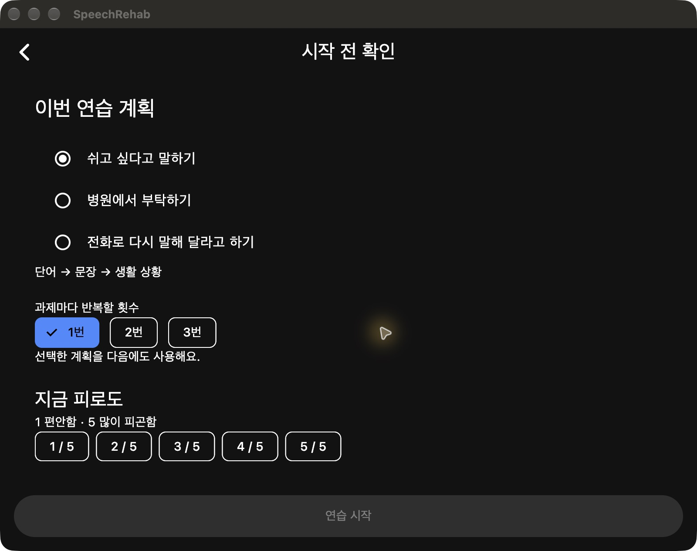
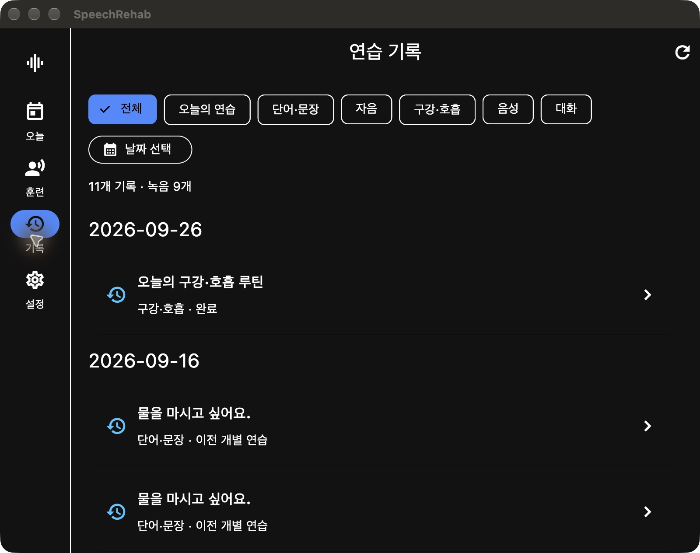

# 성인 후천성 마비말장애 자가훈련 중심 개편

2026-09-26 구현. 기준: `blueprint-acquired-dysarthria-daily-rehab.md` 5절.

## 적용한 흐름

- 모든 화면 폭에서 오늘 / 훈련 / 기록 / 설정의 네 목적지를 유지한다. 폭 변경 시 선택 메뉴와 기록 필터를 유지한다.
- 홈은 저장한 생활 주제 계획 또는 중단한 연습을 한 버튼으로 시작한다. 기존 인식 점수에 따른 추천은 제거했다.
- 훈련은 또렷하게 말하기, 문장, 생활 상황, 편안한 발성, 속도와 쉼으로 나눈다. 구강·호흡은 선택적 준비운동으로 배치하고 기존 잠금을 유지한다.
- 단어 게임 표시명은 단어 말하기로 바꾸고, 훈련 메뉴 진입 시 시간 제한을 끈다. 자유 대화는 생활 속 말하기 안의 선택 항목으로 남긴다.
- 새 오늘의 연습은 단어 → 관련 문장 → 생활 상황의 세 과제다. 쉬기·병원 부탁·전화 다시 듣기의 한국어/영어 기본 문구를 제공한다. 매 과제 1~3회 반복을 선택하며 시작/재진입 전에 피로를 확인한다.
- 인식 서버 없이 녹음·재생·저장·이어하기가 가능하다. TTS 예시는 합성 음성이라고 표시한다. 녹음하지 않은 과제는 발화/완료 수에 넣지 않는다.
- 백그라운드 전환 시 녹음을 종료·저장하고 쉼 상태로 바꾼다. 저장 실패 시 다음 단계와 종료를 막고 같은 시도의 재저장을 제공한다.
- 신규 세션은 독립 저장소에 ID 기준으로 갱신한다. 기존 단어·문장, 자음, 구강·호흡, 음성, 대화 기록은 읽기 어댑터로 통합하며 원본을 이동하거나 덮어쓰지 않는다.
- 통합 기록은 날짜·종류 필터, 재생, 동일 문장 녹음 비교, 해당 문장 재연습, 개별 파일 공유를 제공한다. 자유 응답과 음성 측정은 동일 문장 비교에서 제외한다.
- 새 세션 삭제 시 다른 새 세션이 참조하는 녹음을 보존한다. 저장소 반영 실패 시 파일을 지우지 않으며, 파일 삭제 실패는 별도로 안내한다. 기존 개별 연습의 관리 화면도 유지한다.
- 설정에서 100/125/150/200% 글자 크기를 저장한다. 마이크 권한은 앱 진입 전체를 막지 않고 녹음할 때 요청한다. 기존 일반 연습의 인식 결과는 펼침 영역으로 옮겼다.

## 실제 구현 범위와 후속 구분

이번 버전은 P0 메뉴·진입 개편과 P1의 핵심 연습·저장·재개 흐름을 구현했다. P2 중 날짜 선택, 쉼 단서, 녹음 공유도 포함한다.

- 하루 시간 목표는 기존 설정에서 유지하고 홈에 표시한다. **이번 계획은 반복 횟수 기준**이며, 5/10/15분에 맞춰 콘텐츠를 자동 편성하거나 활동 시간을 추정하지 않는다.
- 통합 기록은 날짜 선택 달력과 날짜별 목록이다. 월간 완료 히트맵, 사용자 지정 기준 녹음, CSV/PDF 보고서는 아직 없다.
- 생활 상황은 오프라인 고정 질문이다. AI 대화의 회차/목표 오케스트레이션과 검토된 개인별 처방 확장은 포함하지 않는다.
- 이전 분석·운동 플레이어는 유지했다. 신규 일상 연습 플레이어와 모든 과거 플레이어를 하나의 실행 엔진으로 통합한 것은 아니다.
- 강제 종료 직전 아직 종료되지 않은 녹음 파일의 자동 복구는 보장하지 않는다. 정상적인 쉬기/화면 이탈/백그라운드 전환 시 종료해 저장한 단계까지 재개한다.
- 새 기본 문구는 제품 예시다. 임상 효과, 개인별 훈련 용량, 실제 iOS/Android 마이크 및 VoiceOver/TalkBack 검증은 별도 출시 검증이 필요하다.

## 검증

- `flutter analyze --no-pub`: 통과.
- 전체 Flutter 테스트: 126개 통과. 이후 360px·200% 글자 크기의 한국어/영어 메뉴 검사를 추가했고, 관련 10개 테스트도 모두 통과했다.
- 신규 회귀 항목: 동시에 저장한 세션 보존, 중복 저장 방지, 손상된 저장소 덮어쓰기 금지, 기존 기록 불변, 자유 응답 비교 제외, 저장 실패 재시도, 녹음 없는 일부 완료, 백그라운드 중단/저장, 화면 폭 변경 시 기록 필터 유지.
- `flutter build macos --debug --no-pub`: 성공.
- macOS 앱에서 홈, 훈련, 준비, 통합 기록을 직접 확인했다. 기존 저장 기록이 조회됐다. 실제 환자 발화를 녹음하거나 공유하지 않았다.

## 화면

