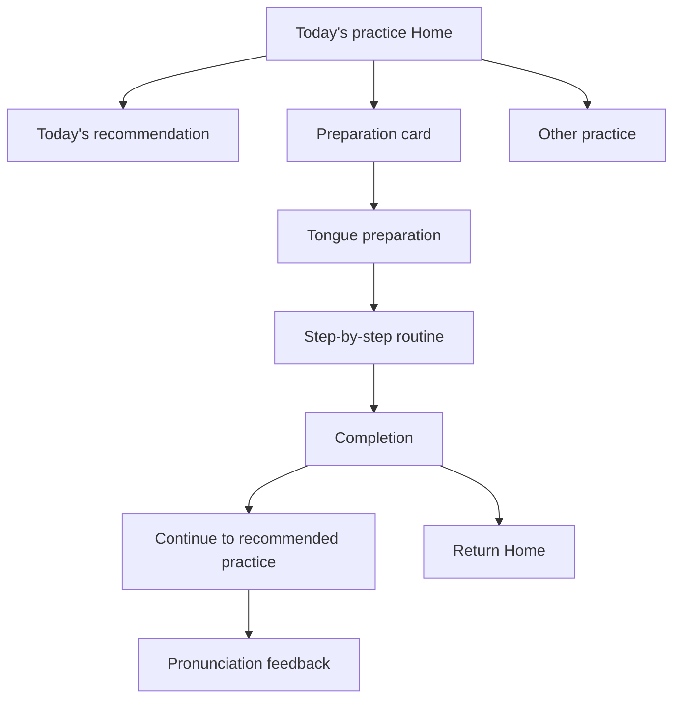

# Tongue-Exercise Menu Placement Review

[한국어](tongue-exercise-menu-review-2026-06-05.md) | [English](tongue-exercise-menu-review-2026-06-05.en.md) | [All documents](README.en.md)

Date: 2026-06-05
Scope: Speech Rehab today's-practice Home, practice screen, dashboard, and history.

## Conclusion

Place tongue exercises under preparation before pronunciation practice, not alongside speech-assessment modes such as word game, short/long reading, and free speech.

Implementation status as of 2026-06-24:

- `/tongue_exercise` is connected in `lib/main.dart`.
- Home has a full-width “Before practice / 3-minute tongue exercises” card.
- The dashboard has a tongue-routine card with “Repeat tongue exercises” after today's completion.
- Completion also offers repetition in place.
- GLB 3D previews have been removed from preparation/execution screens.
- The app no longer uses `model_viewer_plus`, GLB, or a WebView-based 3D viewer.
- Canvas-based 2D layers draw lips, mouth cavity, teeth, tongue, and cheek-press highlights for each step.

Recommended order:

```text
Today's condition summary
→ Today's recommended practice
→ Preparation: 3-minute tongue exercises
→ Other practice choices
→ This week's activity
→ Safety guidance
```

Do not insert a fifth card into the two-column mode grid. Tongue exercises have a different purpose from recording/STT/AI-scored speech practice.

## Why a separate preparation card works

### 1. Less decision burden

Home recommends one activity to start now. A fifth equal-priority mode reintroduces a decision.

Better roles:

- Recommendation: actual speaking practice.
- Tongue exercise: preparation before starting.
- Other modes: choose an alternative to the recommendation.

### 2. Different data

Existing speaking modes center on:

- Target word/sentence.
- Recording file.
- Recognition result.
- Pronunciation score.
- AI feedback.

Tongue exercises center on:

- Completed steps.
- Elapsed time.
- Before/after fatigue.
- Interruption status.
- Whether the user continued to speaking practice.

Start with a separate screen/record model rather than adding `tongueExercise` to `PracticeMode` and forcing it into the recording/evaluation loop.

### 3. Clearer safety guidance

Physical movement instructions matter more here than audible speech. A dedicated screen can first explain safety and comfortable movement ranges rather than opening a recording screen from a small card.

## Recommended menu structure

### Home

Position: below the recommendation and above other practice choices.
Format: horizontal full-width card.

```text
Before practice
3-minute tongue exercises
Gently prepare your mouth and tongue before pronunciation practice.
[Start tongue exercises]
```

States:

```text
Not completed today: 3-minute routine
Completed today: Done today
Fatigue 4 or above: Just one short minute
```

Suggested icons:

- `Icons.self_improvement`
- `Icons.face_retouching_natural`
- `Icons.health_and_safety_outlined`

Colors:

- Use `tealAccent` or muted teal because recommendations already use green/blue.
- Avoid orange/red, which could be confused with safety warnings.

### Practice screen

Position: inside or immediately below the session card.

Show when:

- Tongue practice has not been completed today.
- Fatigue is at least 3.
- The user is about to start long sentences/free speech.

```text
Try tongue exercises before starting?
Three minutes of preparation can help you approach long sentences more slowly.
[Tongue exercises] [Practice now]
```

- Do not force the prompt every time.
- Always allow “Practice now.”

### Dashboard

Position: near seven-day activity or below recommended actions.
Purpose: show routine continuity without mixing it into performance scores.

```text
Tongue routine
Completed on 3 of the last 7 days.
Average: 2 minutes 40 seconds
```

CTA: `Start today's tongue exercises`.

### History

In the first implementation, keep records inside tongue practice rather than immediately mixing them into unified history.

Reasons:

- Unified history centers on conversation/pronunciation practice.
- Adding more scoreless records could blur the list's meaning.
- Integrate later under a broader activity-record type.

## Proposed screen flow



## Tongue-exercise screens

### 1. Preparation

Purpose: explain how to begin safely.

- Title: Tongue exercises.
- Description: Gently prepare the mouth and tongue before pronunciation practice.
- Safety card.
- Pre-practice fatigue.
- CTA: Start 3-minute routine.

Safety copy:

```text
Stop immediately and consult a professional if you experience pain, choking, difficulty swallowing, breathing discomfort, dizziness, or sudden speech changes.
```

### 2. Execution

Purpose: follow one movement at a time.

- Current step, e.g. 2 / 6.
- Exercise name.
- GLB-based 3D tongue/mouth preview.
- Short instruction.
- Timer or repetition count.
- Pause, Next, Stop.
- Bottom checklist.

### 3. Completion

Purpose: connect preparation to speaking.

- Completion message.
- Completed step count.
- Duration.
- Post-practice fatigue.
- Primary: Start recommended practice.
- Secondary: Repeat tongue exercises.
- Secondary: Return Home.

## Initial content

MVP: 5–6 steps, around three minutes.

| Order | Exercise | Amount |
|---|---|---|
| 1 | Open mouth comfortably and extend tongue | 10 seconds |
| 2 | Move tongue left/right | 5 cycles |
| 3 | Move tongue up/down | 5 cycles |
| 4 | Lightly touch tongue tip to palate | 10 seconds |
| 5 | Slowly circle around lips | Once each direction |
| 6 | Relax mouth/jaw and rest | 20 seconds |

Wording:

- Avoid “hard,” “all the way,” or “push yourself.”
- Use “slowly,” “within a comfortable range,” and “It is okay to rest.”
- Use short, repeatable exercise names.

## Implementation proposal

### Route

File: `lib/main.dart`

```dart
'/tongue_exercise': (context) => const TongueExerciseScreen(),
```

### Home menu

File: `lib/features/practice/view/practice_mode_selection_screen.dart`

Insertion point:

```text
_buildRecommendedPractice(...)
const SizedBox(height: 16)
_buildTongueExerciseWarmupCard(context)
const SizedBox(height: 22)
_buildSectionTitle('다른 연습 선택')
```

Card action:

```dart
Navigator.pushNamed(context, '/tongue_exercise');
```

### 2D tongue animation

File: `lib/features/exercise/widgets/animated_exercise_avatar.dart`.
Rendering: Canvas-based 2D layers.

Layers:

- Lip outline.
- Mouth cavity.
- Teeth.
- Tongue.
- Tongue center line.
- Cheek-press highlight.
- Circle-direction indicator.

The runtime does not use `model_viewer_plus`, GLB, or WebView-based 3D.

### New feature directory

```text
lib/features/tongue_exercise/
├── model/tongue_exercise_step.dart
├── provider/tongue_exercise_provider.dart
└── view/tongue_exercise_screen.dart
```

### History service

`lib/services/tongue_exercise_history_service.dart`

Storage key: `tongue_exercise_history`.

### Suggested models

```dart
class TongueExerciseStep {
  final String id;
  final String title;
  final String instruction;
  final int seconds;
  final int repetitions;
  final IconData icon;
}

class TongueExerciseSession {
  final String id;
  final DateTime timestamp;
  final int completedStepCount;
  final int totalStepCount;
  final int durationSeconds;
  final int fatigueBefore;
  final int? fatigueAfter;
  final List<String> completedStepIds;
}
```

## Priorities

### Priority 1

- Home preparation card.
- Dedicated tongue screen.
- Three-minute routine.
- Continue to recommended practice after completion.

### Priority 2

- Save completion records.
- Show “Done today” on Home.
- Show seven-day completion count on the dashboard.

### Priority 3

- Fatigue-based suggestions in practice.
- Caregiver viewing mode.
- Per-user routine customization.

## Placements to avoid

### 1. A fifth card in the two-column mode grid

- Breaks grid balance.
- Makes tongue movement look like scored speech practice.
- May create an expectation of tongue-exercise scores.

### 2. Dashboard only

- A retrospective screen is a weak starting point.
- Harder to use as a daily routine.

### 3. History toolbar only

- The app's starting point is today's practice.
- Tongue exercise belongs before practice rather than record lookup.

## Final recommendation

Place a preparation card directly below the Home recommendation. Users may begin speaking immediately or first complete a three-minute routine.

Use a separate `TongueExerciseScreen` and record model rather than forcing it into `PracticeMode`, allowing addition without changing the recording/STT/AI evaluation flow.
