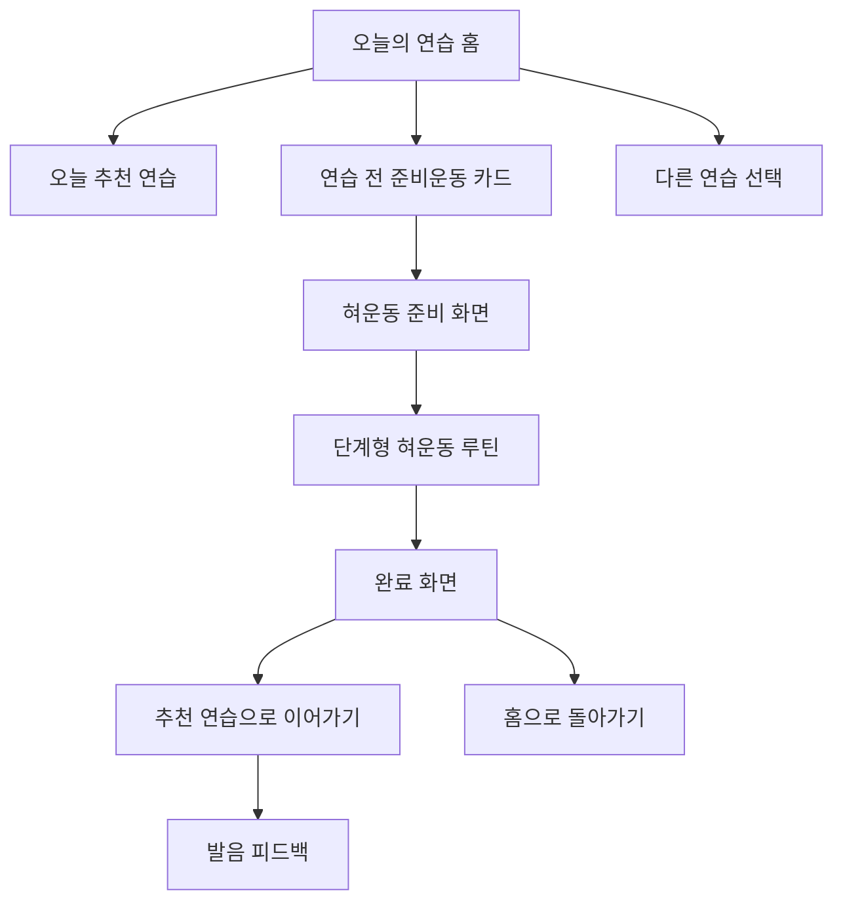

# 혀운동 메뉴 배치 검토

작성일: 2026-06-05  
대상: Speech Rehab `오늘의 연습` 홈, 연습 화면, 대시보드, 히스토리

## 결론

혀운동은 `단어 게임`, `짧은 문장 읽기`, `긴 문장 읽기`, `자유 말하기`와 같은 발화 평가 모드로 넣기보다, 발음 연습 전에 하는 `준비운동` 메뉴로 넣는 것이 좋다.

2026-06-24 기준 구현 상태:

- `lib/main.dart`에 `/tongue_exercise` 라우트가 연결되어 있다.
- `오늘의 연습` 홈에는 `연습 전 준비운동 / 혀운동 3분` full-width 카드가 배치되어 있다.
- 대시보드에는 `혀운동 루틴` 카드가 있고, 오늘 완료 후에는 `혀운동 다시 하기` CTA를 표시한다.
- 혀운동 완료 화면에도 `혀운동 다시 하기` 버튼을 추가해 루틴을 같은 자리에서 여러 번 반복할 수 있다.
- 혀운동 준비/진행 화면의 GLB 3D 미리보기는 제거되었다.
- 현재 앱은 `model_viewer_plus`, GLB, WebView 기반 3D 뷰어를 사용하지 않는다.
- 혀 모양은 Canvas 기반 2D 레이어로 처리하며, 입술/입 안쪽/치아/혀/볼 밀기 하이라이트를 단계별로 그린다.

추천 배치는 다음 순서다.

```text
오늘 상태 요약
→ 오늘 추천 연습
→ 연습 전 준비운동: 혀운동 3분
→ 다른 연습 선택
→ 이번 주 흐름
→ 안전 안내
```

즉, 홈 화면의 2열 모드 그리드 안에 다섯 번째 카드로 끼워 넣지 않는다. 혀운동은 점수 평가, 녹음, STT, AI 피드백 중심의 기존 연습 모드와 목적이 다르기 때문이다.

## 왜 별도 준비운동 카드가 좋은가

### 1. 사용자의 판단 부담이 줄어든다

현재 홈 화면은 `오늘 추천 연습`을 중심으로 "바로 시작할 한 가지"를 제안하는 구조다. 여기에 혀운동을 같은 급의 다섯 번째 연습 모드로 넣으면 사용자는 다시 선택해야 한다.

더 좋은 흐름:

- 오늘 추천 연습: 실제 발화 연습
- 혀운동: 시작 전 몸풀기
- 다른 연습 선택: 추천과 다른 연습으로 바꾸고 싶을 때

### 2. 데이터 성격이 다르다

기존 연습 모드는 다음 데이터를 중심으로 한다.

- 목표 문장 또는 단어
- 녹음 파일
- 음성 인식 결과
- 발음 점수
- AI 피드백

혀운동은 다음 데이터가 중심이다.

- 완료한 운동 단계
- 소요 시간
- 시작 전/후 피로도
- 중단 여부
- 다음 연습 연결 여부

따라서 `PracticeMode`에 `tongueExercise`를 추가해 기존 녹음/평가 루프에 넣는 것보다, 별도 화면과 별도 기록 모델로 시작하는 편이 안전하다.

### 3. 안전 안내를 더 명확히 할 수 있다

혀운동은 소리 내어 말하기보다 신체 움직임 안내가 중요하다. 홈의 작은 카드에서 바로 녹음 화면으로 보내기보다, 혀운동 전용 화면에서 안전 안내와 "편안한 범위에서"라는 기준을 먼저 보여주는 것이 적합하다.

## 추천 메뉴 구조

### 홈 화면

위치: `오늘 추천 연습` 카드 아래, `다른 연습 선택` 위

형태: 가로형 full-width 카드

문구:

```text
연습 전 준비운동
혀운동 3분
입과 혀를 천천히 풀고 발음 연습을 시작해요.
[혀운동 시작]
```

상태 표시:

```text
오늘 완료 전: 3분 루틴
오늘 완료 후: 오늘 완료
피로도 4 이상: 짧게 1분만
```

추천 아이콘:

- `Icons.self_improvement`
- `Icons.face_retouching_natural`
- `Icons.health_and_safety_outlined`

추천 색상:

- 기존 홈의 추천 연습이 초록/파랑을 쓰므로, 혀운동은 `tealAccent` 또는 낮은 채도의 청록 계열이 적합하다.
- 주황/빨강은 안전 경고 카드와 혼동될 수 있어 피한다.

### 연습 화면

위치: `오늘의 연습 세션` 카드 안 또는 바로 아래

노출 조건:

- 아직 오늘 혀운동을 완료하지 않았을 때
- 피로도 3 이상일 때
- 사용자가 긴 문장/자유 말하기를 시작하려 할 때

문구:

```text
시작 전 혀운동을 해볼까요?
3분만 준비하면 긴 문장을 더 천천히 읽기 좋습니다.
[혀운동] [바로 연습]
```

주의:

- 매번 강제로 띄우지 않는다.
- 사용자가 `바로 연습`을 선택할 수 있어야 한다.

### 대시보드

위치: `최근 7일 연습 활동` 근처 또는 추천 액션 카드 아래

목적:

- 혀운동을 성과 점수와 섞지 않고 "루틴 지속성"으로 보여준다.

문구:

```text
혀운동 루틴
최근 7일 중 3일 완료했습니다.
평균 2분 40초
```

CTA:

```text
오늘 혀운동 시작
```

### 히스토리

1차 구현에서는 통합 히스토리에 바로 섞지 않는 것이 좋다. 대신 혀운동 화면 안에 자체 기록을 둔다.

이유:

- 통합 히스토리는 대화/발음 연습 기록 중심이다.
- 혀운동 기록까지 같은 목록에 섞으면 "점수 없는 기록"이 늘어나 목록 의미가 흐려질 수 있다.
- 추후 `활동 기록`이라는 상위 타입을 만들 때 통합하는 편이 더 깔끔하다.

## 화면 흐름 제안



## 혀운동 화면 구성

### 1. 준비 화면

목적: 사용자가 안전하게 시작하도록 기준을 알려준다.

구성:

- 제목: `혀운동`
- 설명: `발음 연습 전 입과 혀를 천천히 준비합니다.`
- 안전 안내 카드
- 시작 전 피로도 선택
- CTA: `3분 루틴 시작`

안전 문구:

```text
통증, 사레, 삼킴 곤란, 호흡 불편, 어지러움, 갑작스러운 말 변화가 있으면 즉시 중단하고 전문가에게 문의하세요.
```

### 2. 진행 화면

목적: 한 번에 하나의 움직임만 따라 하게 한다.

구성:

- 현재 단계 번호: `2 / 6`
- 운동 이름
- GLB 기반 3D 혀/입 구조 미리보기
- 짧은 지시문
- 타이머 또는 반복 횟수
- `일시정지`, `다음`, `중단`
- 하단 체크리스트

### 3. 완료 화면

목적: 혀운동이 다음 발화 연습으로 이어지게 한다.

구성:

- 완료 메시지
- 완료 단계 수
- 소요 시간
- 종료 후 피로도
- CTA: `추천 연습 시작`
- 보조 CTA: `혀운동 다시 하기`
- 보조 CTA: `홈으로 돌아가기`

## 콘텐츠 기본안

MVP는 5-6단계, 3분 내외가 적합하다.

| 순서 | 운동 | 기준 |
|---|---|---|
| 1 | 편안히 입 벌리고 혀 내밀기 | 10초 |
| 2 | 혀 좌우 움직이기 | 좌우 5회 |
| 3 | 혀 위아래 움직이기 | 위아래 5회 |
| 4 | 혀끝 입천장에 가볍게 대기 | 10초 |
| 5 | 혀로 입술 둘레 천천히 돌기 | 양방향 1회 |
| 6 | 입과 턱 힘 빼고 쉬기 | 20초 |

표현 원칙:

- `세게`, `끝까지`, `무리해서` 같은 표현을 피한다.
- `천천히`, `편안한 범위에서`, `잠깐 쉬어도 괜찮아요`를 사용한다.
- 운동 이름은 짧고 반복 가능한 말로 쓴다.

## 구현안

### 라우트

파일: `lib/main.dart`

```dart
'/tongue_exercise': (context) => const TongueExerciseScreen(),
```

### 홈 메뉴

파일: `lib/features/practice/view/practice_mode_selection_screen.dart`

추가 위치:

```text
_buildRecommendedPractice(...)
const SizedBox(height: 16)
_buildTongueExerciseWarmupCard(context)
const SizedBox(height: 22)
_buildSectionTitle('다른 연습 선택')
```

카드 동작:

```dart
Navigator.pushNamed(context, '/tongue_exercise');
```

### 2D 혀 애니메이션 가이드

파일:

```text
lib/features/exercise/widgets/animated_exercise_avatar.dart
```

렌더링 방식:

```text
Canvas 기반 2D 레이어
```

레이어:

- 입술 외곽
- 입 안쪽
- 치아
- 혀
- 혀 중앙선
- 볼 밀기 하이라이트
- 원 그리기 방향 표시

앱 런타임은 `model_viewer_plus`, GLB, WebView 기반 3D 뷰어를 사용하지 않는다.

### 신규 기능 디렉터리

```text
lib/features/tongue_exercise/
├── model/tongue_exercise_step.dart
├── provider/tongue_exercise_provider.dart
└── view/tongue_exercise_screen.dart
```

### 기록 서비스

```text
lib/services/tongue_exercise_history_service.dart
```

저장 키:

```text
tongue_exercise_history
```

### 추천 데이터 모델

```dart
class TongueExerciseStep {
  final String id;
  final String title;
  final String instruction;
  final int seconds;
  final int repetitions;
  final IconData icon;
}

class TongueExerciseSession {
  final String id;
  final DateTime timestamp;
  final int completedStepCount;
  final int totalStepCount;
  final int durationSeconds;
  final int fatigueBefore;
  final int? fatigueAfter;
  final List<String> completedStepIds;
}
```

## 추천 우선순위

### 1순위

- 홈에 `연습 전 준비운동` 카드 추가
- 혀운동 전용 화면 추가
- 3분 루틴 진행
- 완료 후 추천 연습으로 이동

### 2순위

- 혀운동 완료 기록 저장
- 홈에서 `오늘 완료` 상태 표시
- 대시보드에 최근 7일 완료 횟수 표시

### 3순위

- 연습 화면에서 피로도 기반 혀운동 제안
- 보호자와 함께 보기 모드
- 사용자별 루틴 커스터마이징

## 피해야 할 배치

### 1. 2열 모드 그리드에 다섯 번째 카드로 추가

문제:

- 그리드 균형이 깨진다.
- 혀운동이 발화 평가 모드처럼 보인다.
- 사용자가 "혀운동도 점수가 나오나?"라고 기대할 수 있다.

### 2. 대시보드에만 추가

문제:

- 대시보드는 사후 확인 화면이라 시작성이 낮다.
- 매일 루틴으로 쓰기 어렵다.

### 3. 히스토리 상단 액션에만 추가

문제:

- 현재 앱의 기본 시작점은 `오늘의 연습`이다.
- 혀운동은 기록 조회보다 연습 시작 전 행동에 가깝다.

## 최종 제안

혀운동 메뉴는 `오늘의 연습` 홈에서 추천 연습 바로 아래에 `연습 전 준비운동` 카드로 넣는다. 사용자가 바로 발화 연습을 시작할 수도 있고, 필요하면 3분 혀운동을 먼저 할 수도 있는 구조가 가장 자연스럽다.

기능적으로는 `PracticeMode`에 억지로 넣지 말고 별도 `TongueExerciseScreen`과 별도 기록 모델로 시작한다. 이렇게 하면 녹음/STT/AI 평가 흐름을 건드리지 않고도 혀운동을 안전하게 추가할 수 있다.
