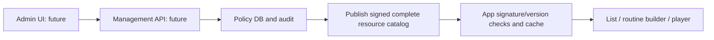

# Training availability and management server design

[한국어](training-availability-and-server.md) | [English](training-availability-and-server.en.md) | [All documents](README.en.md)

<!-- reader-link --> [Read with language tabs](https://clevekim00.github.io/mj_dialog/documents/docs/training-availability-and-server.en.html)

Updated: 2026-10-01. This supersedes earlier descriptions that clinician-guided exercises are locked.

## Implemented behavior

- All **46 exercises** under Training → Oral training are open by default: tongue 14, lips 12, alternating sounds 10, breathing 10. Clinician-guided exercises can be opened, started and selected for personal routines.
- `safetyTier` controls guidance and presentation, independently of `TrainingAvailability.isEnabled(exerciseId)`. Existing advice to consult a professional remains.
- The bundled catalog has `defaultEnabled: true` and empty `overrides`. Older catalogs without this field also open everything. An individual `false` closes an exercise; `true` or removing its override reopens it.
- Administratively closed exercises display a lock and cannot start through direct player entry. Loading policy blocks execution temporarily; loading failures provide retry.
- Routines skip closed exercises and record `skipped: true`. A new routine cannot start when all items are closed. Existing routine selections are preserved; closed items cannot be newly added. Saved-session resume checks the current policy.
- A policy snapshot is held for the session when starting or resuming saved progress. Remote changes do not abruptly interrupt an active session; they apply to subsequent sessions.
- Recommended routines remain unchanged. Opening clinician-guided exercises does not automatically recommend them.

The implemented control covers the **46 individual oral/breathing exercises**. Consonant, sentence, MPT and game activities remain open as before. Remote control of their individual content IDs requires connecting the same policy check at their execution boundaries.

## App/server connection



The app integration is implemented. Configure an HTTPS `RESOURCE_CATALOG_URL` and an Ed25519 `RESOURCE_CATALOG_PUBLIC_KEY` at build time. Never embed signing private keys or admin tokens. Startup checks run in the background and refresh catalog subscribers. The default check interval is six hours; Resource management in Settings also supports a forced check. There is no real-time push or periodic background polling.

Add this field to the existing **complete** catalog response. Do not return this fragment alone: `languages`, `packs`, `catalogVersion`, `schemaVersion`, and `signature` are also required.

```json
{
  "trainingAvailability": {
    "schemaVersion": 1,
    "defaultEnabled": true,
    "overrides": {
      "breathing_03_rapid_deep": false,
      "tongue_08_resistance": true
    }
  }
}
```

Each publication increments `catalogVersion` and signs the entire document. Exclude only `signature`, recursively sort object keys, encode compact UTF-8 JSON and base64-encode the 64-byte Ed25519 signature. Follow `canonicalResourceJson`/`Ed25519ResourceSignatureVerifier`, use constrained JSON values such as integers, and test signing compatibility across languages.

Offline requests, malformed responses and invalid signatures retain the last verified cache. A damaged active catalog falls back to previous, then the bundled all-open catalog if neither is usable. Reinstallation/cache deletion opens everything until a policy is downloaded. This is an operational configuration mechanism, not payment authorization or an immediate security revocation mechanism. New/missing IDs are also open, so publication must validate IDs.

## Management API contract — designed, server not implemented

Machine-readable contract: [OpenAPI JSON](../server/training_management/openapi.json). These future endpoints are not registered in the pronunciation-analysis server.

| Method/path | Purpose | Authorization |
|---|---|---|
| `GET /v1/admin/trainings` | List the 46 IDs, categories, names and draft states | Admin read |
| `GET /v1/admin/training-policy` | Full policy, revision and ETag | Admin read |
| `PUT /v1/admin/trainings/{trainingId}/availability` | Change one enabled flag with a required reason | Admin write |
| `POST /v1/admin/training-policy/publish` | Publish a specified revision as a signed catalog | Publisher |
| `GET /v1/admin/training-policy/audit` | Read who changed/published what, when and why | Audit read |
| `GET /v1/resources/catalog` | Fetch the complete signed catalog with ETag/304 support | Public read |

Example:

```http
PUT /v1/admin/trainings/breathing_03_rapid_deep/availability
Authorization: Bearer <admin access token>
If-Match: "policy-12"
Content-Type: application/json

{"enabled": false, "reason": "Replacing the demonstration video"}
```

Return `200`, a new revision and `ETag: "policy-13"`. Send `true` to reopen. Changes affect the draft only until publication. Publish with `{"revision":13}` and a unique `Idempotency-Key`. Admin UI distinguishes **saved / published / app propagation may be delayed**.

Errors: unauthenticated `401`, insufficient permission `403`, unknown ID `404`, stale If-Match `412`, missing If-Match `428`, invalid input `422`, publication conflict or reused idempotency key with different content `409`, throttling `429`. Successful HTTP publication does not imply immediate delivery to offline apps.

## Data model and implementation sequence

- `training_registry`: id PK, category, title_ko, title_en, app_content_version. IDs must match the app registry; arbitrary IDs cannot be created.
- `policy_revision`: revision PK, full_overrides JSON, created_at, actor_id. Revisions are immutable.
- `policy_audit`: actor_id, action, training_id, before/after, reason, revision, request_id, timestamp. No patient or audio data.
- `policy_publication`: revision, unique catalog_version, signed_document, etag, published_at, actor_id, idempotency_key, request_hash.
- Use OIDC/organization login with read/write/publish/audit role checks. Analysis user tokens do not grant admin privileges.
- Write revisions and audit entries in one transaction. Publishing preserves existing language/pack metadata, builds a complete catalog, signs it, uploads an immutable object, then atomically switches the public pointer. Failures retain the existing public version.
- Rollback republishes an earlier state as a **new revision and higher catalogVersion**. The app does not accept older versions.
- Phase 1: DB, authentication, listing, individual updates and concurrent-write tests. Phase 2: signing, publication, ETag, audit and failure recovery. Phase 3: admin UI, HTTPS hosting, key management, monitoring and app integration verification.

## Server capabilities and current implementation level

“Implemented” means repository code exists, not that a production service is deployed.

| Capability | Current level | Remaining work |
|---|---|---|
| Analysis `GET /health`, `/ready` | FastAPI implemented | Deployment and actual model readiness |
| Analysis job creation/read/delete | Implemented with tests | Production login/token-provider integration |
| Korean/English MFA alignment | Backend and setup scripts implemented | Models, runtime setup and real-audio validation |
| Pronunciation accuracy / GoP scores | Intentionally unavailable (`null`) | Validated scoring backend |
| Analysis token checks, ownership, TTL, upload limits | Implemented | External login/token issuer integration |
| Multiple analysis workers / persistent job DB | Not implemented; memory and single worker | Shared DB, queue and distributed limits |
| Resource catalog/pack download | App client implemented | Hosting, admin API and signing pipeline |
| Per-exercise availability for 46 exercises | App implemented in this change | Live management server connection |
| Admin login, policy changes, audit, publication | API/data design only | Server and admin UI implementation |
| Cloud record/routine/MPT synchronization | No server; local app storage | Accounts, consent, storage and synchronization design |
| AI conversation | Local Gemma app layer exists | This is not a custom cloud AI server |

Evidence: `server/pronunciation_analysis/app/main.py`, `app/security.py`, `lib/services/resources/`, `lib/services/training/training_availability*.dart`, and `lib/features/guided_training/view/`.

## Validation

Tests cover all-open defaults, legacy catalogs, individual overrides, malformed policy rejection, offline cached closures, direct-entry blocking, routine skipping and existing player progress/persistence. Production management-server E2E testing requires a future implementation and deployment.

## Sentence analysis server added (2026-10-02)

The separate `/v1/sentence-analysis` API implements readiness/languages, upload/durable queue/polling/cancellation/deletion, local Korean/English ASR, observations/fixed guidance, owner authentication, idempotency and 15-minute expiry. This is separate from per-training availability administration; an admin UI and production login/token issuance still need implementation. [Setup and limitations](../server/pronunciation_analysis/README.en.md#free-sentence-analysis-server-2026-10-02).
