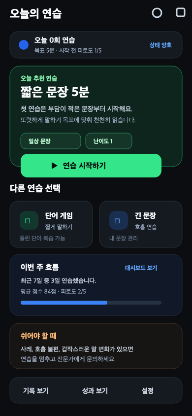
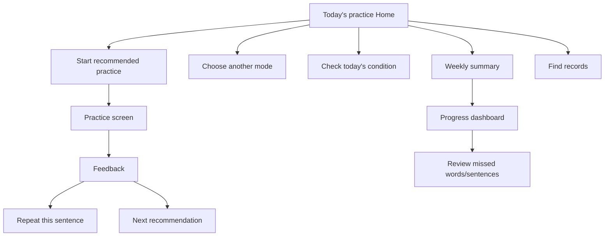

# Speech Rehab UI Design Review and Recommendations

[한국어](ui-improvement-review-2026-06-04.md) | [English](ui-improvement-review-2026-06-04.en.md) | [All documents](README.en.md)

<!-- reader-link --> [Read with language tabs](https://clevekim00.github.io/mj_dialog/documents/docs/ui-improvement-review-2026-06-04.en.html)

> Current navigation (2026-10-01): **Today → Training → Games → Records → Settings**. See [Games and current entry points](game-menu.en.md). Earlier plans and reviews below retain their dated context.

Date: 2026-06-04
Scope: main-screen captures at mobile 390×844 and Flutter UI code.

## Review summary

The UI consistently uses a black background, information cards, large icons, and voice-centered controls. High contrast and few screens are strengths for users with speaking difficulties.

However, available features appear before a clear answer to “What should I do today?” A rehabilitation-support app should help people start without repeated decisions. The main improvement is to shift Home and the dashboard from feature selection toward a suggested next action.

## Proposed screen concept

The improved today's-practice Home should show recommended practice, today's goal, safety status, and next action first, with other modes as secondary choices.

## Main issues

### 1. Weak home-screen priorities

Today's summary and four mode cards currently have similar weight.

Evidence: `docs/ui-captures/03_practice_modes.png`
Code: `lib/features/practice/view/practice_mode_selection_screen.dart`

Users must repeatedly choose among word game, short sentence, long sentence, and free conversation. Suggesting one starting activity can reduce that burden more than showing many choices.

Direction:

- Make “Today's recommended practice” the largest top card.
- Briefly explain why, e.g. “Yesterday's short-sentence scores were steady, so today continues with long sentences.”
- Emphasize one CTA, e.g. “Start 5 minutes of long sentences.”
- Move other modes into smaller secondary cards or a lower list.

### 2. Core practice controls are pushed downward

Short-sentence reading stacks session goals, fatigue, mode selection, target text, and the recording orb. At 390px the orb is cut off at the bottom of the first viewport, delaying discovery of the main action.

Evidence: `docs/ui-captures/05_short_sentence_practice.png`
Code: `lib/features/practice/view/practice_screen.dart`

Direction:

- Compress goals/fatigue into a collapsible “Today's condition” section.
- Place “Start recording” directly below the target sentence.
- Pair the orb with explicit states such as “Listening,” “Awaiting assessment,” and “Ready to record again.”
- Before practice, prioritize target sentence + start button over explanations.

### 3. Dashboard analysis does not lead clearly to action

The dashboard presents counts, average/best scores, per-mode records, and difficult sound groups, but gives little direction afterward.

Evidence: `docs/ui-captures/10_dashboard.png`
Code: `lib/features/practice/view/dashboard_screen.dart`

Direction:

- Add a “Next recommendation” CTA below the summary.
- Link difficult sound groups to “Review missed words.”
- Present a plain-language weekly summary before the seven-day chart.
- Plan a shareable weekly summary for caregivers as a longer-term feature.

### 4. Repeated safety advice lacks clear action rules

Onboarding and session cards contain safety advice, but stopping and continuing criteria are mixed together.

Evidence: `docs/ui-captures/02_onboarding.png`, `docs/ui-captures/05_short_sentence_practice.png`
Code: `lib/features/onboarding/view/rehab_onboarding_screen.dart`, `lib/features/practice/view/practice_screen.dart`

Direction:

- Keep full safety guidance in onboarding; summarize condition on Home.
- Provide a small “Stop if uncomfortable” link/button during practice.
- At fatigue 4 or higher, show a message shortening recommended practice time.

### 5. History and dashboard roles overlap

Unified history lists records, practice history supports detailed review, and the dashboard shows statistics. Their shared emphasis on records can obscure where users should act.

Evidence: `docs/ui-captures/08_history.png`, `docs/ui-captures/09_practice_history.png`, `docs/ui-captures/10_dashboard.png`

Direction:

- History: find records by date.
- Practice history: repeat a specific sentence.
- Dashboard: see this week's condition and next recommendation.

## Proposed information architecture

## Priority roadmap

### Priority 1: restructure today's-practice Home

High impact with relatively small scope: rearrange recommendation and mode cards in `PracticeModeSelectionScreen`.

Changes:

- Top: condition summary—practice count, fatigue, goal.
- Middle: recommended mode, reason, and five-minute start CTA.
- Bottom: other modes in two columns or a compact list.
- Retain History/Dashboard top icons but strengthen accessible labels.

### Priority 2: focus sentence screens on action

Users spend most time here. Adjust density so target text and recording controls reliably fit in the first viewport.

Changes:

- Collapse or compress the session card.
- Adapt target text size and spacing by screen.
- Add an explicit button above or below the orb.
- Offer repeat, next sentence, and rest together after completion.

### Priority 3: make the dashboard actionable

A dashboard limited to inspection may be used less. Help users return directly from analysis to practice.

Changes:

- CTA based on difficult sound groups.
- Plain-language weekly summary.
- Caregiver sharing as a separate follow-up feature.

## Example copy

| Location | Current emphasis | Suggested wording |
|---|---|---|
| Home recommendation | Feature recommendation | Start with `5 minutes of short sentences` today |
| Recommendation reason | Generic guidance | You are less tired than yesterday, and short-sentence scores are steady |
| Practice state | Implicit state | Listening. Finish the sentence, then request assessment |
| Dashboard recommendation | Statistics | Review `ㄹ/ㅁ` sounds three more times this week |
| History CTA | Record management | Practice this sentence again |

## Implementation notes

- Reduce choices on each screen and use action-oriented CTA wording for users with speaking difficulties.
- Keep the dark theme, but do not give green, blue, orange, and purple equal emphasis. Choose blue or green as the primary recommendation accent.
- Keep the orb as a recognizable feature, but never make it the only control; always provide button text.
- Follow current radii/spacing while giving minor choices lower background contrast.

## Conclusion

The goal is to help daily users decide less and start sooner. Organize Home around recommendations, practice around recording, and the dashboard around the next review activity so the UI better matches the app's purpose.
