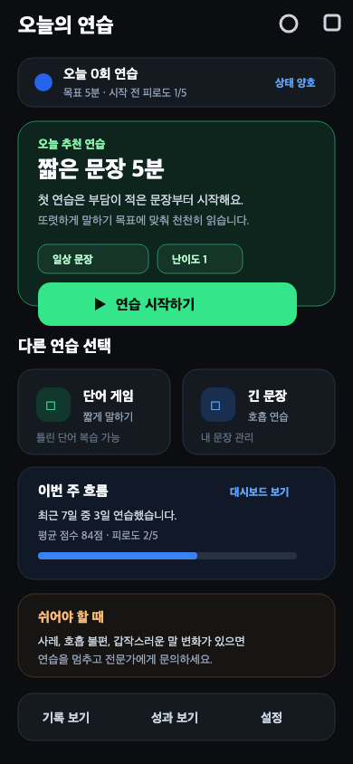
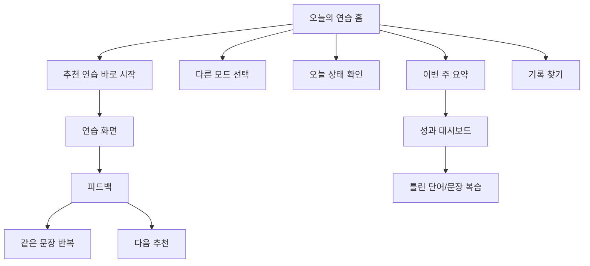

# Speech Rehab UI 디자인 검토 및 개선 제안

작성일: 2026-06-04  
대상: 모바일 390x844 기준 주요 화면 캡처와 Flutter UI 코드

## 검토 요약

Speech Rehab의 현재 UI는 검은 배경, 카드형 정보 구조, 큰 아이콘, 음성 중심 조작을 일관되게 사용한다. 말하기가 불편한 사용자를 위한 앱이라는 점에서 대비가 높고 화면 수가 적은 점은 장점이다.

다만 현재 화면은 "오늘 무엇을 하면 되는지"보다 "선택할 수 있는 기능 목록"이 먼저 보인다. 재활 보조 앱에서는 사용자가 매번 판단하지 않아도 바로 시작할 수 있어야 하므로, 홈과 대시보드의 중심을 기능 선택에서 다음 행동 추천으로 옮기는 것이 가장 큰 개선 방향이다.

## 개선 화면 시안

아래 시안은 `오늘의 연습` 홈을 개선했을 때의 방향이다. 추천 연습, 오늘 목표, 안전 상태, 다음 행동을 한 화면에서 먼저 보여주고, 나머지 모드는 보조 선택지로 낮춘다.

## 핵심 문제

### 1. 홈 화면의 우선순위가 약함

현재 `오늘의 연습` 화면은 오늘 기록 요약과 네 개 모드 카드가 거의 같은 무게로 배치되어 있다.

근거 화면: `docs/ui-captures/03_practice_modes.png`  
관련 코드: `lib/features/practice/view/practice_mode_selection_screen.dart`

사용자는 "단어 게임, 짧은 문장, 긴 문장, 자유 대화 중 무엇을 해야 하지?"를 매번 결정해야 한다. 특히 재활/훈련 앱에서는 선택지를 많이 보여주는 것보다 오늘 시작할 한 가지를 명확히 제안하는 편이 부담을 줄인다.

개선 방향:

- 최상단에 `오늘 추천 연습`을 가장 큰 카드로 둔다.
- 추천 이유를 짧게 설명한다. 예: "어제 짧은 문장 점수가 안정적이라 오늘은 긴 문장으로 이어갑니다."
- CTA는 하나만 강하게 둔다. 예: `긴 문장 5분 시작`
- 나머지 모드는 작은 보조 카드 또는 하단 목록으로 낮춘다.

### 2. 연습 화면의 핵심 조작이 아래로 밀림

짧은 문장 읽기 화면은 세션 목표, 피로도, 모드 선택, 목표 문장, 녹음 구슬이 세로로 이어진다. 390px 폭 캡처 기준으로 녹음 구슬이 첫 화면 하단에서 잘려 보여 핵심 행동이 늦게 드러난다.

근거 화면: `docs/ui-captures/05_short_sentence_practice.png`  
관련 코드: `lib/features/practice/view/practice_screen.dart`

개선 방향:

- 세션 목표와 피로도는 접을 수 있는 `오늘 상태` 영역으로 줄인다.
- 목표 문장 카드 바로 아래에 `녹음 시작` 버튼을 고정 배치한다.
- 녹음 중 상태는 구슬만으로 표현하지 말고 텍스트 상태를 함께 둔다. 예: `듣는 중`, `판정 대기`, `다시 녹음 가능`
- 연습 전에는 설명보다 "읽을 문장 + 시작 버튼"이 먼저 보이게 한다.

### 3. 대시보드는 분석은 좋지만 다음 행동 연결이 약함

성과 대시보드는 연습 횟수, 평균 점수, 최고 점수, 모드별 기록, 어려운 발음군을 잘 보여준다. 하지만 사용자가 데이터를 본 뒤 바로 무엇을 해야 할지 연결이 약하다.

근거 화면: `docs/ui-captures/10_dashboard.png`  
관련 코드: `lib/features/practice/view/dashboard_screen.dart`

개선 방향:

- 상단 요약 아래에 `다음 추천` CTA를 추가한다.
- 어려운 발음군이 있으면 `틀린 단어 복습`으로 연결한다.
- 최근 7일 기록은 차트보다 "이번 주 흐름" 문장 요약을 먼저 보여준다.
- 보호자와 함께 보는 상황을 고려해 "이번 주 공유 요약" 버튼을 장기 과제로 둔다.

### 4. 안전 안내가 반복 노출되지만 행동 기준이 부족함

온보딩과 연습 세션 카드에 안전 안내가 잘 들어가 있다. 그러나 사용자가 실제로 멈춰야 하는 기준과 계속해도 되는 기준이 같은 문단 안에 섞여 있다.

근거 화면: `docs/ui-captures/02_onboarding.png`, `docs/ui-captures/05_short_sentence_practice.png`  
관련 코드: `lib/features/onboarding/view/rehab_onboarding_screen.dart`, `lib/features/practice/view/practice_screen.dart`

개선 방향:

- 온보딩에서는 안전 고지를 충분히 보여주되, 홈에서는 `오늘 상태 괜찮음` 정도로 요약한다.
- 연습 화면에는 `불편하면 중지` 링크 또는 작은 버튼을 둔다.
- 피로도 4 이상이면 추천 연습 시간을 자동으로 줄이는 메시지를 보여준다.

### 5. 히스토리와 대시보드의 역할이 겹침

통합 히스토리는 기록 목록, 연습 기록 화면은 상세 복기, 대시보드는 통계라는 역할을 가진다. 현재는 세 화면 모두 기록을 보여주기 때문에 사용자가 어느 화면에서 무엇을 해야 하는지 헷갈릴 수 있다.

근거 화면: `docs/ui-captures/08_history.png`, `docs/ui-captures/09_practice_history.png`, `docs/ui-captures/10_dashboard.png`

개선 방향:

- 히스토리: 날짜별 기록 찾기
- 연습 기록: 특정 문장 다시 연습하기
- 대시보드: 이번 주 상태와 다음 추천 보기

## 제안 정보 구조

## 우선순위 로드맵

### 1순위: 오늘의 연습 홈 재구성

효과가 가장 크고 구현 범위가 비교적 작다. 기존 `PracticeModeSelectionScreen`의 추천 카드와 모드 카드를 재배치하면 된다.

변경안:

- 상단에 오늘 상태 요약: 연습 횟수, 피로도, 목표
- 중간에 추천 연습 카드: 추천 모드, 이유, 5분 시작 CTA
- 하단에 다른 모드 선택: 2열 또는 압축 리스트
- 상단 아이콘 버튼은 `기록`, `대시보드`로 유지하되 라벨 접근성을 강화

### 2순위: 짧은/긴 문장 연습 화면 액션 집중

연습 화면은 사용자가 가장 오래 머무는 화면이다. 목표 문장과 녹음 조작이 첫 화면 안에 안정적으로 들어오도록 밀도를 조정한다.

변경안:

- `오늘의 연습 세션` 카드는 접기/펼치기 또는 압축 카드로 변경
- 목표 문장 카드의 텍스트 크기와 여백을 화면별로 조정
- 녹음 구슬 아래 또는 위에 명확한 버튼 추가
- 완료 후 `같은 문장 반복`, `다음 문장`, `쉬기`를 나란히 제공

### 3순위: 대시보드의 행동성 강화

대시보드는 정보 확인에서 끝나면 사용 빈도가 낮아질 수 있다. 사용자가 분석을 보고 곧바로 연습으로 돌아가게 만드는 것이 좋다.

변경안:

- 어려운 발음군 기반 추천 CTA
- 이번 주 요약 문장
- 보호자 공유용 요약은 후속 기능으로 분리

## 화면별 개선 문구 예시

| 위치 | 현재 성격 | 개선 문구 예시 |
|---|---|---|
| 홈 추천 카드 | 기능 추천 | 오늘은 `짧은 문장 5분`부터 시작해요 |
| 홈 추천 이유 | 일반 안내 | 어제보다 피로도가 낮고, 짧은 문장 점수가 안정적입니다 |
| 연습 화면 상태 | 암묵적 상태 | 듣는 중입니다. 문장을 끝까지 읽은 뒤 판정해 주세요 |
| 대시보드 추천 | 통계 확인 | 이번 주에는 `ㄹ/ㅁ` 발음을 3번 더 복습해 보세요 |
| 히스토리 CTA | 기록 관리 | 이 문장 다시 연습 |

## 구현 시 주의점

- 말하기가 불편한 사용자를 고려해 한 화면 안의 선택지는 줄이고, CTA 문구는 동사로 끝낸다.
- 현재 다크 테마는 유지하되 초록, 파랑, 주황, 보라가 모두 같은 강도로 보이지 않게 한다. 추천 흐름은 파랑 또는 초록 하나를 주 강조색으로 고정하는 것이 좋다.
- 원형 구슬 인터랙션은 앱의 상징으로 유지하되, 구슬만 누르는 구조는 피한다. 항상 버튼 텍스트를 함께 제공한다.
- 카드 반경과 여백은 현재 앱 스타일을 따르되, 작은 보조 선택지는 더 낮은 배경 대비로 정리한다.

## 결론

이번 라운드의 핵심은 화면을 더 예쁘게 꾸미는 것이 아니라, 매일 연습하는 사용자가 덜 고민하고 더 빨리 시작하게 만드는 것이다. 홈은 추천 중심, 연습 화면은 녹음 행동 중심, 대시보드는 다음 복습 중심으로 정리하면 앱의 목적과 UI 흐름이 더 잘 맞는다.
