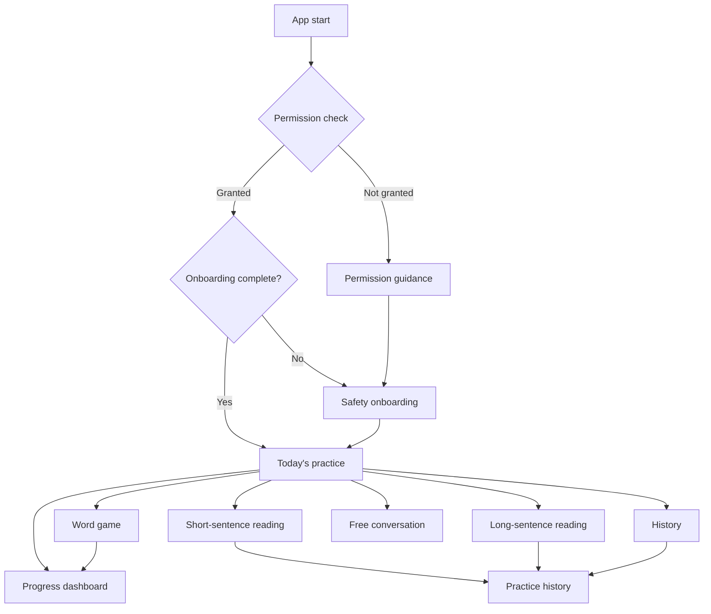

# SpeechRehab Screen Inventory and UI Review Material

[한국어](ui-screen-inventory.md) | [English](ui-screen-inventory.en.md) | [All documents](README.en.md)

<!-- reader-link --> [Read with language tabs](https://clevekim00.github.io/mj_dialog/documents/docs/ui-screen-inventory.en.html)

> Current navigation (2026-10-01): **Today → Training → Games → Records → Settings**. See [Games and current entry points](game-menu.en.md). Earlier plans and reviews below retain their dated context.

Date: 2026-06-03

## Screen-count summary

- Actual screen classes: 9.
- Startup branches/user-accessible screens: 9.
- Captures for UI review: 10.

`PracticeScreen` is one class, but targets and controls differ for short-sentence reading, long-sentence reading, and free/word modes. At minimum, review short and long sentences as separate states.

## Entry and navigation

## Captures, features, and opportunities

| No. | Screen | File | Main features | UI improvement |
|---|---|---|---|---|
| 1 | Permission guidance | `docs/ui-captures/01_permission.png` | Microphone/recognition permission, system settings | Copy emphasizes AI counseling rather than practice. Explain permissions through pronunciation assessment and recording storage. |
| 2 | Safety onboarding | `docs/ui-captures/02_onboarding.png` | Safety acknowledgement, practice period, goal, daily duration, caregiver status | Too much information pushes confirmation below the first viewport. Use steps or a fixed bottom CTA. |
| 3 | Today's practice | `docs/ui-captures/03_practice_modes.png` | Today's count; word/short/long/conversation entry; history/dashboard | Cards have similar weight. Emphasize recommended practice above secondary options. |
| 4 | Word game | `docs/ui-captures/04_word_game.png` | Difficulty, successes/failures/average, falling-word area, start | Preparation is clear; enlarge the current word, automatic input state, and feedback during play. |
| 5 | Short-sentence reading | `docs/ui-captures/05_short_sentence_practice.png` | Goal, fatigue, mode switching, target, recording orb | The orb is clipped below. Bring target text and recording controls closer within one viewport. |
| 6 | Long-sentence reading | `docs/ui-captures/06_long_sentence_practice.png` | Long targets, personal sentences, breathing/phrasing practice | Same `PracticeScreen`, but sentence management/reading support matter more. Separate management buttons from the long-text area. |
| 7 | Free conversation | `docs/ui-captures/07_free_chat.png` | Conversational voice input, central orb state, microphone start/end | Minimal but weak learning context. Show the current goal, recent feedback, and topic to help users know what to say. |
| 8 | History | `docs/ui-captures/08_history.png` | Combined AI/practice list, all/practice tabs, new conversation/practice entry | Mixed records obscure meaning. Visually distinguish scores, modes, and dates and clarify detail entry. |
| 9 | Practice history | `docs/ui-captures/09_practice_history.png` | Scores, targets, metadata, recognition, feedback, playback/delete | Dense cards. Move score, difficult sounds, and repeat action to the top to connect records to practice. |
| 10 | Progress dashboard | `docs/ui-captures/10_dashboard.png` | Total/average/best, mode counts, difficult sounds, seven-day activity, distribution | Good data structure but no obvious next activity. Add a recommendation CTA based on difficult sounds. |

## Screen classes

| Class | Path | Entry |
|---|---|---|
| `PermissionScreen` | `lib/features/chat/view/permission_screen.dart` | Startup without permission |
| `RehabOnboardingScreen` | `lib/features/onboarding/view/rehab_onboarding_screen.dart` | Startup before onboarding completion |
| `PracticeModeSelectionScreen` | `lib/features/practice/view/practice_mode_selection_screen.dart` | Default Home, `/practice_modes` |
| `WordGameScreen` | `lib/features/practice/view/word_game_screen.dart` | `/word_game` |
| `PracticeScreen` | `lib/features/practice/view/practice_screen.dart` | `/practice` |
| `ChatScreen` | `lib/features/chat/view/chat_screen.dart` | Free-conversation card/new conversation from history |
| `HistoryScreen` | `lib/features/chat/view/history_screen.dart` | History action on today's practice |
| `PracticeHistoryScreen` | `lib/features/practice/view/practice_history_screen.dart` | `/practice_history` |
| `DashboardScreen` | `lib/features/practice/view/dashboard_screen.dart` | `/dashboard` |

`HistoryScreen` combines conversation/practice history; `PracticeHistoryScreen` is detailed practice-only history. Both count as separate user screens. `StartupResolver` is a startup routing loader rather than a screen.

## Priority candidates

1. Align permission/onboarding copy with the app's current purpose.
2. Add a recommended-practice area to Home.
3. Improve recording-control placement for short/long sentences.
4. Separate long-sentence registration/selection into a management panel.
5. Improve target/input-state visibility during the word game.
6. Add practice-again CTAs to history/dashboard.

## Implemented on 2026-06-03

This UI round implemented the following priorities:

- Replace AI-counseling permission copy with recording, recognition, and pronunciation-assessment explanations.
- After permission, users who completed onboarding go to today's practice rather than history.
- Fix the onboarding start CTA to the bottom so the next action remains visible while reading safety guidance.
- Add a recent-history-based recommendation card to Home.
- Add explicit “Start recording” / “Assess” buttons to sentence screens rather than requiring an orb tap.
- Allow target-card top actions to wrap on narrow screens.
- Add dedicated “Add sentence” / “Manage sentences” panels for long-sentence mode.
- Add “Practice this sentence again” to practice records.
- Add a score-trend-based recommendation CTA to the dashboard.
- Allow metadata in unified-history practice records to wrap.
- Separate “Repeat this sentence” and “Next short sentence” after short-sentence completion, showing the current sentence's repetition count on the target card.

Validation:

- `dart analyze`
- `flutter test`

## Technical UI issues found during capture

- The target-card top Row in `PracticeScreen` may overflow at 390px.
- The metadata Row in `HistoryScreen` may also overflow at narrow widths.
- Capture tests require `audioplayers` and `flutter_tts` mocks. This is a test-environment concern rather than evidence of an actual runtime failure, but automated visual regression needs mock providers.
