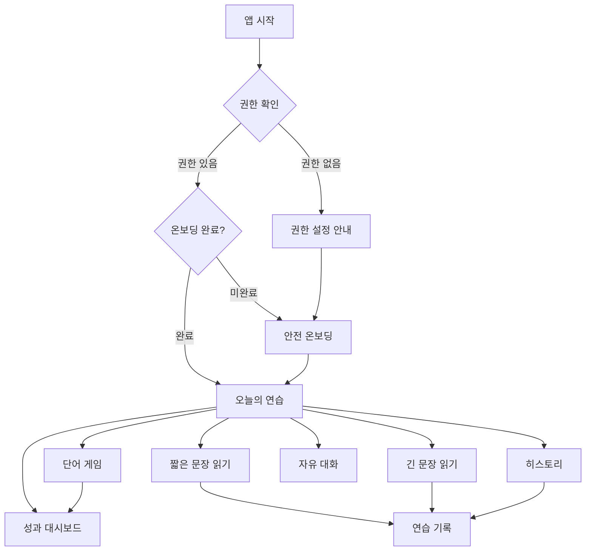

# SpeechRehab 화면 구성 및 UI 개선 검토 자료

작성일: 2026-06-03

## 화면 수 요약

- 실제 화면 클래스 기준: 9개
- 시작 분기/사용자 접근 화면 기준: 9개
- UI 개선 검토용 캡처 기준: 10개

`PracticeScreen`은 하나의 화면 클래스지만 `짧은 문장 읽기`, `긴 문장 읽기`, `자유/단어 모드`에 따라 목표와 조작 흐름이 달라진다. 그래서 개선 작업에서는 최소한 짧은 문장과 긴 문장을 별도 상태로 보는 것이 좋다.

## 앱 진입 및 이동 구조

## 화면별 캡처 및 기능 정리

| 번호 | 화면 | 파일 | 주요 기능 | UI 개선 포인트 |
|---|---|---|---|---|
| 1 | 권한 설정 안내 | `docs/ui-captures/01_permission.png` | 마이크/음성 인식 권한 요청, 시스템 설정 이동 | 앱 목적이 "AI 상담" 중심으로 설명되어 현재 연습 앱 목적과 어긋남. 권한 필요 이유를 발음 평가/녹음 저장 기준으로 다시 쓰는 것이 좋음. |
| 2 | 안전 온보딩 | `docs/ui-captures/02_onboarding.png` | 안전 안내 확인, 연습 기간, 목표, 하루 연습 시간, 보호자 여부 입력 | 첫 화면 정보량이 많아 아래 확인 버튼이 첫 viewport 밖으로 밀림. 단계형 온보딩 또는 하단 고정 CTA가 적합. |
| 3 | 오늘의 연습 | `docs/ui-captures/03_practice_modes.png` | 오늘 연습 횟수 요약, 단어 게임/짧은 문장/긴 문장/자유 대화 진입, 히스토리/대시보드 이동 | 현재 카드들이 비슷한 무게로 보여 추천 흐름이 약함. "오늘 추천 연습"을 상단에 강조하고 나머지는 보조 선택지로 정리하면 좋음. |
| 4 | 단어 게임 | `docs/ui-captures/04_word_game.png` | 난이도 선택, 성공/실패/평균 점수, 낙하 단어 영역, 게임 시작 | 게임 시작 전 화면은 명확함. 실행 중에는 목표 단어, 자동 음성 입력 상태, 판정 피드백이 더 크게 보여야 함. |
| 5 | 짧은 문장 읽기 | `docs/ui-captures/05_short_sentence_practice.png` | 세션 목표, 피로도, 모드 전환, 목표 문장, 녹음 구슬 | 화면 하단 구슬이 잘려 보인다. 핵심 액션이 아래로 밀려 있어 목표 문장과 녹음 컨트롤을 한 화면 안에 더 가깝게 배치해야 함. |
| 6 | 긴 문장 읽기 | `docs/ui-captures/06_long_sentence_practice.png` | 긴 문장 목표, 사용자 등록 문장 관리, 호흡/끊어 읽기 연습 | 같은 `PracticeScreen` 구조를 쓰지만 긴 문장에는 문장 관리/읽기 보조가 더 중요함. 사용자 등록 문장 버튼과 긴 문장 표시 영역을 더 명확히 분리해야 함. |
| 7 | 자유 대화 | `docs/ui-captures/07_free_chat.png` | 대화형 음성 입력, 중앙 구슬 상태, 마이크 시작/종료 | 미니멀하지만 학습 앱 맥락이 약함. 현재 목표, 최근 피드백, 대화 주제를 작게라도 보여주면 사용자가 무엇을 말해야 할지 덜 막막함. |
| 8 | 히스토리 | `docs/ui-captures/08_history.png` | AI 대화/연습 기록 통합 목록, 전체/연습 기록 탭, 새 대화/연습 선택 이동 | 대화 기록과 연습 기록이 섞여 의미가 조금 흐림. 점수/모드/날짜를 시각적으로 더 강하게 나누고, 기록 상세 진입을 명확히 해야 함. |
| 9 | 연습 기록 | `docs/ui-captures/09_practice_history.png` | 연습별 점수, 목표 문장, 메타 정보, 인식 결과, 피드백, 녹음 재생/삭제 | 정보는 충분하지만 카드 밀도가 높음. 점수, 문제 발음, 재연습 버튼을 상단 액션으로 올리면 기록이 다음 연습으로 연결됨. |
| 10 | 성과 대시보드 | `docs/ui-captures/10_dashboard.png` | 총 연습 횟수, 평균/최고 점수, 모드별 횟수, 어려운 발음군, 최근 7일 활동, 점수 분포 | 데이터 구조는 좋음. 하지만 첫 화면에서 "다음에 무엇을 연습할지"가 보이지 않음. 어려운 발음군 기반 추천 CTA를 추가하면 대시보드의 행동성이 올라감. |

## 코드상 화면 목록

| 화면 클래스 | 경로 | 접근 방식 |
|---|---|---|
| `PermissionScreen` | `lib/features/chat/view/permission_screen.dart` | 앱 시작 시 권한 미허용 |
| `RehabOnboardingScreen` | `lib/features/onboarding/view/rehab_onboarding_screen.dart` | 앱 시작 시 온보딩 미완료 |
| `PracticeModeSelectionScreen` | `lib/features/practice/view/practice_mode_selection_screen.dart` | 앱 기본 홈, `/practice_modes` |
| `WordGameScreen` | `lib/features/practice/view/word_game_screen.dart` | `/word_game` |
| `PracticeScreen` | `lib/features/practice/view/practice_screen.dart` | `/practice` |
| `ChatScreen` | `lib/features/chat/view/chat_screen.dart` | 자유 대화 카드/히스토리 새 대화 |
| `HistoryScreen` | `lib/features/chat/view/history_screen.dart` | 오늘의 연습 상단 히스토리 |
| `PracticeHistoryScreen` | `lib/features/practice/view/practice_history_screen.dart` | `/practice_history` |
| `DashboardScreen` | `lib/features/practice/view/dashboard_screen.dart` | `/dashboard` |

주의: `HistoryScreen`은 기존 대화 히스토리와 연습 히스토리를 통합한 화면이고 `PracticeHistoryScreen`은 연습 전용 상세 기록 화면이다. 실제 사용자 접근 화면으로는 둘 다 별도 화면으로 보는 것이 맞다. `StartupResolver`는 화면이라기보다 시작 분기 로더다.

## 우선 개선 후보

1. 권한/온보딩 문구를 현재 앱 목적에 맞게 정리
2. 오늘의 연습 홈에 "추천 연습" 영역 추가
3. 짧은/긴 문장 연습의 녹음 컨트롤 위치 개선
4. 긴 문장 등록/선택 UI를 별도 관리 패널로 정리
5. 단어 게임 실행 중 음성 입력 상태와 목표 단어 가시성 강화
6. 히스토리와 대시보드에 "다시 연습하기" CTA 추가

## 2026-06-03 구현 반영

이번 UI 개선 라운드에서 위 우선순위 중 다음 항목을 구현했다.

- 권한 화면 문구를 "AI 상담" 중심에서 발음 녹음, 음성 인식, 발음 평가 목적 중심으로 수정했다.
- 권한 허용 후 온보딩이 이미 완료된 사용자는 히스토리가 아니라 `오늘의 연습` 화면으로 이동하도록 수정했다.
- 온보딩의 시작 버튼을 하단 고정 CTA로 바꿔 안전 안내를 읽는 중에도 다음 행동이 항상 보이게 했다.
- `오늘의 연습` 화면에 최근 기록 기반 `오늘 추천 연습` 카드를 추가했다.
- 짧은/긴 문장 연습 화면에 명확한 `녹음 시작` / `판정하기` 버튼을 추가해 구슬만 눌러야 하는 불편을 줄였다.
- 목표 카드 상단 액션 영역을 줄바꿈 가능한 구조로 바꿔 좁은 화면 overflow 가능성을 줄였다.
- 긴 문장 모드에 `문장 추가` / `문장 관리` 전용 패널을 추가했다.
- 연습 기록 카드에 `이 문장 다시 연습` CTA를 추가했다.
- 성과 대시보드에 점수 흐름 기반 추천 연습 CTA를 추가했다.
- 통합 히스토리의 연습 기록 메타 정보를 줄바꿈 가능한 구조로 바꿔 좁은 화면 overflow 가능성을 줄였다.
- 짧은 문장 읽기 완료 후 `같은 문장 반복`과 `다음 짧은 문장` CTA를 분리하고, 현재 문장의 반복 기록 횟수를 목표 카드에 표시했다.

검증:

- `dart analyze`
- `flutter test`

## 캡처 중 발견한 기술적 UI 이슈

- 390px 폭 기준으로 `PracticeScreen` 목표 카드 상단 Row에서 overflow가 발생할 수 있다.
- `HistoryScreen` 목록의 메타 정보 Row도 좁은 폭에서 overflow 가능성이 있다.
- 캡처 테스트 환경에서는 `audioplayers`, `flutter_tts` 플러그인 mock이 필요하다. 실제 앱 실행 문제라기보다는 테스트 환경 이슈지만, 향후 자동 UI 회귀 테스트를 만들려면 mock provider 구성이 필요하다.
